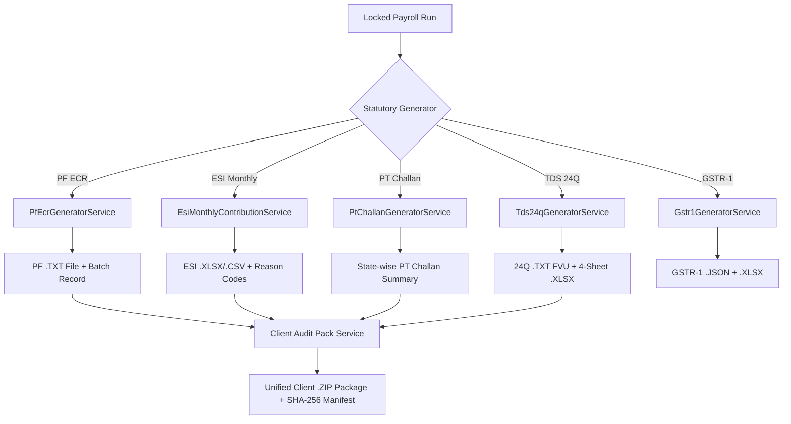

# Tecla Payroll - Compliance Module Complete Workflow Specification

## 1. Executive Summary & Overview

The **Compliance Module** in Tecla Payroll (`https://teclapayroll.tecla.in/public/compliance`) provides an end-to-end, automated statutory compliance management system tailored for Indian payroll operations. It handles statutory filings, file generation, due date tracking, validation checks, and client audit exports across Indian statutory authorities:

- **PF ECR (Employees' Provident Fund Organisation - EPFO)**: Electronic Challan cum Return text file format (`.txt`) with `#~#` delimiter.
- **ESIC Monthly Contribution (Employees' State Insurance Corporation)**: Monthly contribution upload files (`.xlsx` / `.csv`) with zero-day reason codes.
- **Professional Tax (PT) Challans**: State-wise slab calculation, branch reconciliation, and monthly/quarterly challan summaries (Tamil Nadu, Maharashtra, Karnataka, Telangana, West Bengal, Andhra Pradesh, Gujarat, etc.).
- **TDS Form 24Q (Income Tax / Protean e-TDS)**: Quarterly e-TDS return text generator (`.txt` FVU ready) and 4-sheet audit spreadsheet (`.xlsx`) containing File Header (FH), Batch Header (BH), Challan Detail (CD), and Deductee Detail (DD) records.
- **GSTR-1 Outward Supplies (GSTN Portal)**: Invoice and GST outward supply summary generator (`.json` for portal import & `.xlsx` reconciliation).
- **CLRA (Contract Labour Regulation and Abolition Act)**: License tracking and expiry alerts.
- **Client Statutory Audit Pack**: Automated single-click `.zip` bundle combining all statutory output files, verification hashes (`SHA-256`), and manifest metadata for client reporting and audit readiness.

---

## 2. System Architecture & Role-Based Access Control (RBAC)

### Middleware & Module Gating
Access to the Compliance Module is guarded by Laravel route middleware:
- **`auth`**: Ensures user is authenticated.
- **`module:compliance`**: Verifies that the tenant/user has the `compliance` module license enabled.
- **Client Security Isolation**:
  - **Super Admin / Admin**: Full access to all clients and compliance configurations.
  - **Manager**: Access restricted strictly to assigned clients (`$user->isManagerForClient($clientId)`).
  - **Client User**: Access restricted strictly to their own client record (`$user->client_id === $clientId`).

```
                    ┌──────────────────────────────────────────────┐
                    │            HTTP Request /compliance          │
                    └──────────────────────┬───────────────────────┘
                                           │
                                  ┌────────▼────────┐
                                  │ auth Middleware │
                                  └────────┬────────┘
                                           │
                              ┌────────────▼────────────┐
                              │ module:compliance Gate  │
                              └────────────┬────────────┘
                                           │
                   ┌───────────────────────┴───────────────────────┐
                   │                                               │
        ┌──────────▼──────────┐                         ┌──────────▼──────────┐
        │  Admin / Manager    │                         │     Client User     │
        └──────────┬──────────┘                         └──────────┬──────────┘
                   │                                               │
       ┌───────────▼───────────┐                       ┌───────────▼───────────┐
       │ Multi-Client Register │                       │ Single Client View    │
       │ & Global Analytics    │                       │ & Audit Pack Download │
       └───────────────────────┘                       └───────────────────────┘
```

---

## 3. Core Compliance Dashboard Workflow (`/compliance`)

### 3.1 Period Selection & Headcount Aggregation
1. **Period Parameter**: Defaults to current month (`YYYY-MM`) or user-selected month parameter (`?month=2026-06`).
2. **Headcount Deduction**: Computes deduplicated active headcount per client by querying locked payroll run items (`payroll_runs.status = 'locked'`) across both parent and supplementary payroll runs for that period.

### 3.2 Dynamic Statutory Due Dates Engine (`StatutoryDueDateService`)
Due dates are calculated dynamically based on statutory rules:
- **PF ECR**: 15th of the month following the payroll month (e.g., June 2026 payroll → Due July 15, 2026).
- **ESI Monthly**: 15th of the month following the payroll month.
- **PT Challan**: State-specific due dates (e.g., 10th, 15th, 20th, or end of month depending on active state branches).
- **TDS Form 24Q**: 31st of the month following the end of the financial quarter (Q1: July 31, Q2: Oct 31, Q3: Jan 31, Q4: May 31).
- **GSTR-1**: 11th (Monthly filers) or 13th (QRMP filers) of the following month.

### 3.3 Dynamic Status Resolution (`StatutoryFilingResolutionService`)
Filing status for each statute (`pf`, `esi`, `pt`, `tds`, `clra`) is resolved in real time:
- **`filed`**: Automatically marked if a generated batch exists in `pf_ecr_batches`, `esi_monthly_batches`, `pt_challan_batches`, or `tds_24q_batches`, OR if explicitly toggled as filed in `compliance_filings`.
- **`pending`**: Default state if statutory due date has not passed and batch is not generated.
- **`overdue`**: Flagged if current date > statutory due date and status is not `filed`.
- **`exempt` / `not_applicable`**: Resolved if client registration status shows non-coverage (e.g., headcount below ESIC threshold of 10/20 workers).

---

## 4. Sub-Module Detailed Workflows & Technical Specifications



### 4.1 PF ECR Generator (EPFO Portal)
- **Controller**: `PfEcrController`
- **Service**: `PfEcrGeneratorService`
- **Routes**:
  - `GET /compliance/pf-ecr/runs` - List available locked payroll runs.
  - `POST /compliance/pf-ecr/preview` - Preview employee PF wages, LWP/NCP days, and validation flags.
  - `POST /compliance/pf-ecr/generate` - Generate EPFO text file and create `pf_ecr_batches` entry.
  - `GET /compliance/pf-ecr/download/{id}` - Download `#~#` delimited `.txt` file.
  - `POST /compliance/pf-ecr/update-status/{id}` - Update TRRN and status (`generated` → `filed`).
- **File Spec**: Standard EPFO format with `#~#` delimiter:
  `UAN#~#Member Name#~#Gross Wages#~#EPF Wages#~#EPS Wages#~#EDLI Wages#~#EE PF#~#EPS Contrib#~#ER PF Diff#~#NCP Days#~#Refund of Advances`

---

### 4.2 ESI Monthly Contribution Generator (ESIC Portal)
- **Controller**: `EsiMonthlyController`
- **Service**: `EsiMonthlyContributionService`
- **Routes**:
  - `GET /compliance/esi-monthly/runs` - Fetch eligible payroll runs.
  - `GET /compliance/esi-monthly/reason-codes` - Fetch standard ESIC zero-day reason codes (e.g., Leave Without Pay, Retired, Resigned, Out of Coverage).
  - `POST /compliance/esi-monthly/preview` - Preview IP numbers, monthly wages, contributions (0.75% employee, 3.25% employer).
  - `POST /compliance/esi-monthly/generate` - Generate ESIC upload file (`.xlsx` or `.csv`).
  - `GET /compliance/esi-monthly/download/{id}` - Download file.

---

### 4.3 Professional Tax (PT) Challan & State-Wise Reconciliation
- **Controller**: `PtChallanController`
- **Service**: `PtChallanGeneratorService`
- **Routes**:
  - `GET /compliance/pt-challan/runs` - Get payroll runs grouped by state branch.
  - `POST /compliance/pt-challan/preview` - Summarize PT deductions per state slab.
  - `POST /compliance/pt-challan/generate` - Save PT challan record and batch file.
  - `GET /compliance/pt-challan/download/{id}` - Download state PT reconciliation sheet.

---

### 4.4 TDS Form 24Q Quarterly Return (Protean / NSDL e-TDS)
- **Controller**: `Tds24qController`
- **Service**: `Tds24qGeneratorService`
- **Routes**:
  - `GET /compliance/tds-24q/metadata` - Fetch TAN details, financial year, quarter (Q1-Q4).
  - `POST /compliance/tds-24q/preview` - Preview tax deductions, challans, deductee records.
  - `POST /compliance/tds-24q/challan` - Record challan BSR code, deposit date, challan serial number.
  - `POST /compliance/tds-24q/generate` - Generate `.txt` (FVU format) & 4-Sheet `.xlsx` audit file.
  - `GET /compliance/tds-24q/download/{id}` - Download e-TDS text file.
  - `GET /compliance/tds-24q/download-xlsx/{id}` - Download audit spreadsheet.

---

### 4.5 GSTR-1 Outward Supplies Return (GSTN Portal)
- **Controller**: `Gstr1Controller`
- **Service**: `Gstr1GeneratorService`
- **Routes**:
  - `GET /compliance/gstr1/months` - Get available billing months.
  - `POST /compliance/gstr1/preview` - Preview tax invoices, B2B, B2C supplies, GSTINs.
  - `POST /compliance/gstr1/generate` - Generate GSTR-1 `.json` payload & `.xlsx` breakdown.
  - `GET /compliance/gstr1/download/{id}` - Download JSON for direct GST portal import.

---

### 4.6 Client Statutory Audit Pack Generator
- **Controller**: `ClientAuditPackController`
- **Service**: `ClientAuditPackService`
- **Routes**:
  - `GET /compliance/audit-pack/clients` - List clients eligible for audit pack extraction.
  - `POST /compliance/audit-pack/generate` - Create `.zip` bundle combining all generated statutory files (PF, ESI, PT, TDS) for a client & period.
  - `GET /compliance/audit-pack/download/{id}` - Download `.zip` package.
- **Key Security & Design Features**:
  - **Read-only Aggregation**: Collects existing pre-generated batches without mutating payroll or re-running statutory engines.
  - **Audit Manifest (`manifest.json`)**: Embedded JSON manifest containing client metadata, file inventory, SHA-256 cryptographic hashes for every file, and explicit reporting of any missing outputs.

---

## 5. Database Schema Reference

```
┌─────────────────────────────────┐       ┌─────────────────────────────────┐
│            clients              │       │          payroll_runs           │
├─────────────────────────────────┤       ├─────────────────────────────────┤
│ id (PK)                         │◄──────┤ client_id (FK)                  │
│ company_name                    │       │ payroll_month (e.g. 2026-06-01) │
│ pf_establishment_code           │       │ status (locked / draft)         │
│ esi_establishment_code          │       └────────────────┬────────────────┘
│ pan_number / tan_number / gstin │                        │
└────────────────┬────────────────┘                        │
                 │                                         │
        ┌────────┴─────────────────────────────────────────┴────────┐
        │                                                           │
┌───────▼────────────────────────┐                 ┌────────────────▼────────────────┐
│      compliance_filings        │                 │        pf_ecr_batches           │
├────────────────────────────────┤                 ├─────────────────────────────────┤
│ id (PK)                        │                 │ id (PK)                         │
│ client_id (FK)                 │                 │ payroll_run_id (FK)             │
│ statute (pf, esi, pt, tds)     │                 │ trrn / challan_number           │
│ period (Y-m-d)                 │                 │ total_members / total_wages     │
│ status (pending / filed)       │                 │ status (generated / filed)      │
└────────────────────────────────┘                 └─────────────────────────────────┘
```

---

## 6. User Operational Guide (Step-by-Step)

### Step 1: Open Compliance Dashboard
1. Log in to Tecla Payroll with Admin, Manager, or Client User credentials.
2. Navigate to **Compliance** (`/compliance`) from the main sidebar navigation.
3. Use the month picker in the top toolbar to select the desired payroll period (e.g., June 2026).

### Step 2: Review Client Compliance Status Register
1. Inspect the summary cards for **Total Headcount**, **Required Filings**, **Completed Filings**, and **Pending/Overdue Filings**.
2. Filter or search by client name/code.
3. Review statutory due date indicators (Green = Filed/On-time, Yellow = Due Soon, Red = Overdue).

### Step 3: Generate Statutory Upload Files
1. Click on a specific client to open **Client Compliance Details** (`/compliance/clients/{client_id}`).
2. Click **Generate PF ECR**, **Generate ESI Monthly**, **Generate PT Challan**, or **Generate TDS 24Q**.
3. Review the preview data and validation flags (e.g., missing UAN or invalid IP numbers).
4. Click **Generate & Save Batch**.

### Step 4: Download Portal Files & Update Status
1. Click **Download File** to get the portal-ready file (`.txt`, `.csv`, `.xlsx`, or `.json`).
2. Upload the file to the respective government portal (EPFO, ESIC, Income Tax, GSTN).
3. Once paid/filed, enter the TRRN / Challan BSR / Ack Number and click **Mark as Filed**.

### Step 5: Export Client Audit Pack
1. Navigate to **Audit Pack Generator**.
2. Select the client and period.
3. Click **Generate Audit Pack**.
4. Download the unified `.zip` archive for records, client submission, or auditor review.

---

## 7. Verification & Compliance Controls

- **Tenant Isolation Assertions**: Verified by automated test suites (`tests/Feature/ClientAuditPackTest.php`, `tests/Feature/ClientMultiBranchRegressionTest.php`).
- **Cryptographic File Integrity**: All generated audit packs store SHA-256 hashes in `client_audit_pack_batches.file_hash` to guarantee tamper-proof audit trails.
- **Server-side Pagination**: Client detail batch lists use server-side pagination (`per_page=10`) to ensure fast page loads even with thousands of compliance entries.
