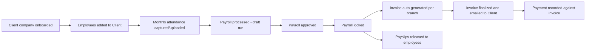
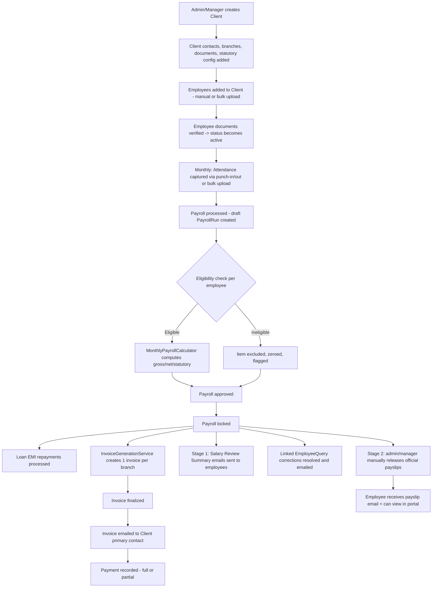
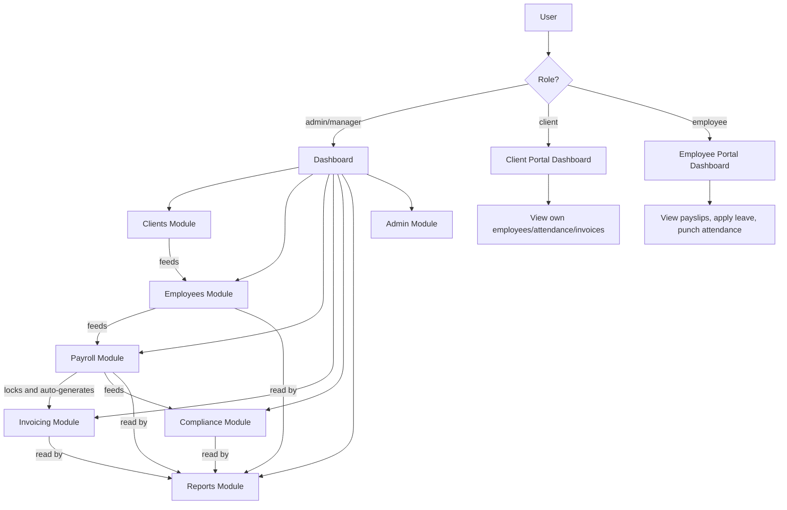
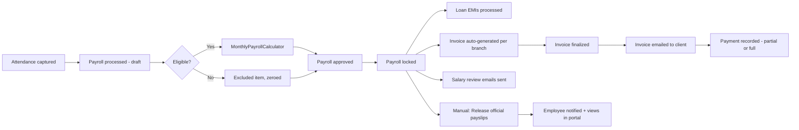
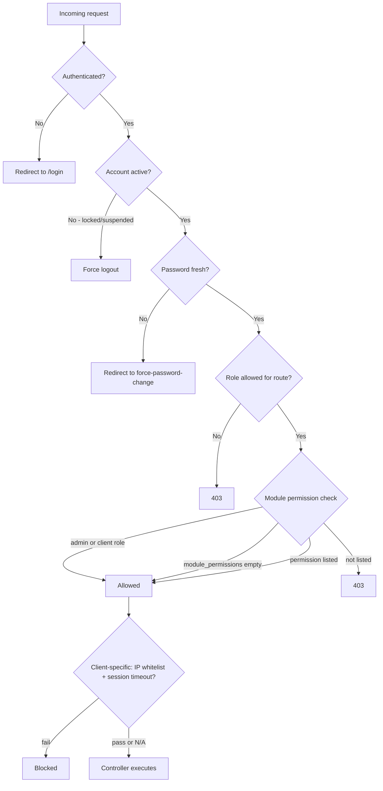

# TECLA PAY CRM — Complete Technical Documentation

> Reverse-engineered directly from the source code at `f:\xampp\htdocs\tecla-payroll` (Laravel 12 / PHP 8.2 / Inertia.js + React 19 / MySQL). Every claim below is either **confirmed** (with a `file:line` citation) or explicitly marked **"Needs confirmation"** where the code did not provide enough evidence. Nothing here was invented — where behavior looked incomplete or inconsistent, that is stated plainly rather than smoothed over.

---

## 1. Project Overview

### What is TECLA PAY CRM?

TECLA PAY CRM is an internal operations platform for a **payroll-outsourcing / staffing agency business** (the "Agency", branded "TECLA" — confirmed via hardcoded fallback `"TECLA AGENCY PRIVATE LIMITED"` in `app/Services/PayslipPdfService.php:27-44` and `InvoicePdfService.php`). The agency takes on **Clients** (other companies) as customers, and for each Client, the agency:

1. Onboards and manages the Client's workforce (**Employees**) as either:
   - **Agency Contract** staff — employed by TECLA and deployed to the Client, or
   - **EOR (Employer of Record)** staff — legally employed "as" the Client for compliance purposes, while TECLA handles the paperwork
   (`employees.employment_model` enum `eor`/`agency_contract`, `database/migrations/2026_07_03_113615_create_employees_table.php`).
2. Runs monthly **payroll** for each Client's employees — attendance, leave, loss-of-pay, salary components, and India-specific statutory deductions (PF, ESI, Professional Tax, TDS, LWF, Gratuity, Bonus).
3. **Bills the Client** for the payroll cost plus an agency service fee (markup, fixed retainer, per-candidate fee, or hourly, depending on the contract) — this is where the CRM/billing side comes in.
4. Tracks **statutory compliance filings** (PF/ESI/PT/TDS/CLRA) per Client.
5. Provides **self-service portals** for both the Client (to view/approve attendance, invoices, employees) and the Employee (to view payslips, apply for leave, punch in/out, raise queries).

### What business problem does it solve?

It replaces what would otherwise be manual spreadsheet-based payroll processing, ad-hoc invoicing, and email-based compliance tracking for a company whose core business is *processing other companies' payroll and staffing*. The "CRM" framing reflects that Clients (the paying customers) are managed much like customer accounts, with account managers, SLAs, contracts, and billing — while the underlying engine is a full India-compliant payroll system.

### Who are the expected users?

Confirmed via the four-value `role` enum on `users` (`admin, manager, client, employee` — `database/migrations/2026_07_03_173413_extend_users_table.php:15`) and the three separate portal folders in the frontend (`resources/js/Pages/{Admin,ClientPortal,EmployeePortal}`):

| Role | Who they are | What they do |
|---|---|---|
| **admin** | TECLA internal staff with full privileges | Full system access — client onboarding, payroll processing/locking, invoicing, statutory settings, user management |
| **manager** | TECLA internal "account manager" staff | Scoped to the Clients they are assigned to manage (via `account_manager_id`/`backup_account_manager_id` on `clients`, or the `client_user` pivot table) — same feature set as admin but data-scoped, and missing a few admin-only actions (delete client/employee, some reports) |
| **client** | An employee of the customer company, given portal access | Views their own company's employees, approves attendance, views invoices, views leave settings |
| **employee** | A staff member being paid through the platform | Views own payslips, applies for leave, punches attendance in/out, raises pay-related queries, requests bank-detail changes |

### What are the major modules?

Derived from the frontend page structure (`resources/js/Pages/*`) and backend route groups (`routes/web.php`), cross-checked against controllers/services:

- **Auth & Account** — login, OTP/2FA, password reset, invitations, session management
- **Dashboard** — role-specific KPI overview
- **Clients** — client (customer) onboarding, contracts, branches, contacts, documents, statutory config
- **Employees** — employee master data, documents, salary revisions, exits, loans, bulk upload
- **Payroll** — attendance capture/upload, leave, payroll processing/approval/locking, payslips, corrections
- **Compliance** — statutory filing tracking (PF/ESI/PT/TDS/CLRA)
- **Invoicing** — auto-generated client invoices, GST, payment tracking
- **Reports** — 18 pre-built operational/financial reports
- **Client Portal** — self-service for customer-company users
- **Employee Portal** — self-service for paid staff
- **Admin** — user management, module permissions, settings, activity log, payslip template customization
- **Notifications** — in-app notifications + a "watcher" email-alert subscription system

### What is the overall application flow?



This is the **real** flow as traced from code (see §6 for full detail with exact controller methods) — it differs from a generic assumption in one important way: **invoices are not created by a user action**, they are a side effect of locking a payroll run (`app/Http/Controllers/PayrollController.php:133-135` calls `InvoiceGenerationService::generateForRun($run)` inside the lock transaction).

### What are the main business processes?

1. Client lifecycle (onboarding → active → deactivation/exit)
2. Employee lifecycle (onboarding → active service → salary revisions → exit/F&F settlement)
3. Monthly payroll cycle (attendance → process → approve → lock → invoice → payslip release)
4. Statutory compliance tracking (independent of payroll — a filing calendar/checklist)
5. Invoice-to-cash (generate → finalize → send → payment tracking → aging/overdue)
6. Employee self-service requests (leave, day-swap, bank-change, attendance correction, pay queries) each with an approval workflow

---

## 2. Technology Stack

*(Confirmed facts only — anything not found is explicitly marked "Not identified".)*

### Backend

| Component | Version | Source |
|---|---|---|
| PHP | `^8.2` | `composer.json:9` |
| Laravel Framework | `^12.0` → resolved **v12.64.0** | `composer.json`, `composer.lock:1502` |
| Inertia Laravel adapter | `^3.1` → **v3.3.0** | `composer.lock:1295` |
| PDF generation | `barryvdh/laravel-dompdf ^3.1` → **v3.1.2** | `composer.lock:11` |
| Excel import/export | `spatie/simple-excel ^3.7` → **3.7.3** | `composer.lock:4045` |
| Route helper (frontend bridge) | `tightenco/ziggy` → **v2.6.3** | `composer.lock:6758` |
| Device/browser detection | `jenssegers/agent ^2.6` → **v2.6.4** (used for session listing) | `composer.lock:1419` |
| REPL | `laravel/tinker ^2.10.1` | `composer.json` |
| Dev/test tooling | `laravel/pint`, `laravel/sail`, `nunomaduro/collision`, `phpunit/phpunit ^11.5.50`, `fakerphp/faker`, `laravel/pail` | `composer.json` |

### Frontend

| Component | Version | Source |
|---|---|---|
| React | `^19.2.7` (React 19) | `package.json` |
| Inertia React adapter | `@inertiajs/react ^3.5.0` | `package.json` |
| Ziggy JS | `^2.6.3` | `package.json` |
| Build tool | `vite ^7.0.7` + `laravel-vite-plugin ^2.0.0` + `@vitejs/plugin-react` | `package.json` |
| CSS | `tailwindcss ^3.4.19` + `autoprefixer` + `postcss` | `package.json` |
| Icons | `lucide-react ^1.23.0` | `package.json` |
| Client-side Excel | `exceljs ^4.4.0` (used for bulk-upload templates) | `package.json` |
| HTTP client | `axios ^1.11.0` | `package.json` |

### Explicitly NOT present (checked, not assumed)

- **jQuery** — not a dependency; one legacy utility (`resources/js/Utils/jqueryValidation.js`) defensively checks `window.$` but always falls through to a pure-DOM path in production since jQuery is never loaded.
- **DataTables** (the jQuery plugin) — Not identified. The project has its own React component confusingly also named `DataTable` (`resources/js/Components/ui/DataTable/DataTable.jsx`), unrelated to the jQuery plugin.
- **Select2** — Not identified anywhere.
- **WhatsApp / Twilio / Nexmo / any SMS gateway** — Not identified in `composer.json`, `package.json`, or `config/services.php`.
- **Sanctum / Breeze / Jetstream / Fortify** — Not present; auth is fully custom (see §3).
- **spatie/laravel-permission** — Not present; roles/permissions are fully custom (see §5).

### Database

- **MySQL** (`DB_CONNECTION=mysql`, `.env`/`.env.example`), database name `tecla_payroll`.
- Version: **Not identified** in the codebase (no engine-specific syntax beyond standard MySQL migrations found).

### Infrastructure / environment

| Concern | Configured value | Notes |
|---|---|---|
| Queue | `QUEUE_CONNECTION=database` (actual `.env:40`; `.env.example` says `sync`, differs from deployed value) | Jobs land in the `jobs` table; **no persistent worker process found** — `routes/console.php:13` schedules `queue:work --stop-when-empty` every minute instead of a supervisor-run daemon (see §14) |
| Cache | `CACHE_STORE=file` | Used only for settings memoization and short-lived bulk-upload wizard session state (see §14) |
| Session | `SESSION_DRIVER=database` | Sessions listable/revocable via `/account/sessions` and `/admin/sessions` |
| Mail | `MAIL_MAILER=log` | Mail is not actually delivered via SMTP in the current env config — only logged. A `MailConfigServiceProvider` can override mail config at runtime from a DB `settings` table |
| Broadcast | `BROADCAST_CONNECTION=log` | No real driver (no Pusher/Reverb/Ably) — Not identified as active |
| Filesystem | `FILESYSTEM_DISK=local` | `s3` disk is fully defined in `config/filesystems.php:50-61` but has no real credentials in `.env.example` — configured but not confirmed active |
| Redis | Env placeholders present | Not confirmed as the active queue/cache/session driver |
| Cron | No `CRON_*` env; relies on OS-level cron calling `artisan schedule:run` every minute (standard Laravel requirement, external to this repo) | |

### Authentication mechanism

Fully custom, session-based (cookie/DB session, no API tokens) — see §3 and §5 for full detail. Includes email-based OTP as a genuine second factor.

### Authorization

Fully custom: a `role` enum column + a JSON `module_permissions` array column on `users`, plus four Laravel Policies. No relational roles/permissions tables. See §5.

### File/storage system

Local disk (`storage/app/private`, not web-served) + a `public` disk symlinked to `public/storage` for branding assets. S3 disk defined but not confirmed in use.

### Email / SMS / WhatsApp integrations

- **Email**: yes, extensively — 17 Blade email templates (`resources/views/emails/*.blade.php`) and matching Mailable classes (`app/Mail/*.php`, 17 classes) covering OTP, invitations, bank-change decisions, document verification, day-swap decisions, salary-revision approval, payroll query resolution, invoice delivery, and a generic "watcher" notification email.
- **SMS**: Not identified.
- **WhatsApp**: Not identified (though `client_contacts.is_whatsapp_same` and `communication_preferences` JSON fields exist on the schema, suggesting it was planned/partially modeled but no integration code was found).

---

## 3. Laravel Architecture

### Routing setup

Laravel 12 skeleton style — `bootstrap/app.php:9-13` calls `withRouting(web: routes/web.php, commands: routes/console.php, health: '/up')`. **There is no `routes/api.php`** — confirmed by the absence of an `api:` key in that call. This is a server-rendered (Inertia) monolith, not a decoupled API backend.

### Middleware pipeline

Global web middleware appended in `bootstrap/app.php:15-20`:
`LogRequestsMiddleware` → `HandleInertiaRequests` → `AddLinkHeadersForPreloadedAssets` (Laravel built-in) → `SecurityHeaders`.

Custom middleware aliases registered in `bootstrap/app.php:24-31`: `role`, `fresh-password`, `active`, `module`, `client.ip`, `client.timeout`. Full inventory (`app/Http/Middleware/*.php`):

| Middleware | Purpose |
|---|---|
| `EnsureUserRole` | Role allow-list check (`role:admin,manager`) |
| `EnsureModulePermission` | Custom module-key ACL check (`module:key,subkey`) |
| `EnsureUserActive` | Force-logs-out locked/suspended users mid-session |
| `RequireFreshPassword` | Redirects to forced password-change flow when due |
| `EnsureClientIpWhitelisted` | IP allow-list for `client`-role portal users |
| `EnforceClientSessionTimeout` | Per-client configurable idle-session timeout for the client portal |
| `LogRequestsMiddleware` | Logs every request/response globally (including full input — see §16) |
| `SecurityHeaders` | Sets `X-Frame-Options`, `X-Content-Type-Options`, `Referrer-Policy`, `Permissions-Policy`, `Strict-Transport-Security` |
| `HandleInertiaRequests` | Shares `auth`, `authConfig`, `branding` (DB-driven), `flash`, `notificationCount` props to every Inertia page |

Exception handling (`bootstrap/app.php:33-46`): 403 responses are intercepted and rendered as an Inertia `Error` page instead of Laravel's default HTML error page.

### Controllers, Services, and how they communicate

The codebase follows a **Controller → Service → Model** pattern, though not uniformly — many controllers also contain sizeable inline business logic (validation, even calculation) rather than delegating everything to a Service. There is no Repository layer.

- **Controllers** (`app/Http/Controllers/`, 26 top-level + `Admin/` 4 files + `Auth/` 5 files = 35 controller files, cross-checked at 38 files including base class) — receive the request, authorize (via role checks, Policies, or `Gate::authorize`), validate (via Form Requests or inline `$request->validate()`), delegate to Services for anything non-trivial, and return either an `Inertia::render()` view, a `redirect()`, or JSON.
- **Services** (`app/Services/`, 27 files + `app/Services/Reports/`, 18 files = 45 total) — hold the actual business/calculation logic: payroll math, statutory calculations, invoice generation, bulk upload processing, authentication logic, settings access, reporting. This is where the real domain logic lives.
- **Models** (`app/Models/`, 39 files) — mostly thin Eloquent models, but a few embed real business rules directly (see below).
- **Requests** (`app/Http/Requests/`, 12 files) — used for the two largest/most complex forms (`StoreClientRequest`/`UpdateClientRequest`, `StoreEmployeeRequest`/`UpdateEmployeeRequest`) with heavy cross-field validation; most other controllers validate inline instead. **3 of the 12 Form Request classes are dead stubs** (`authorize()` returns `false` unconditionally, `rules()` empty) and are never referenced by any controller: `BankChangeRequestRequest`, `EmployeeExitRequest`, `SalaryRevisionRequest`.
- **Jobs** (`app/Jobs/`, 4 files) — queued work: `NotifyWatchersJob`, `ProcessAttendanceBulkUploadJob`, `ProcessBulkUploadJob`, `ProvisionBulkUploadUsersJob`.
- **Events / Listeners** (`app/Events/`, 7 files; `app/Listeners/`, 1 file) — no `EventServiceProvider` exists (Laravel 12 convention); registration happens directly in `AppServiceProvider::boot()` via a **wildcard listener** (`Event::listen('*', ...)`, `app/Providers/AppServiceProvider.php:30-41`) that inspects every dispatched event for a `NotifiesWatchers` contract and fires `NotifyWatchersJob` — a neat but somewhat unusual pattern (most Laravel apps register events explicitly one-by-one).
- **Notifications** — **Not present**. Despite the name "watcher notifications," none of this uses Laravel's `Notification` system (`php artisan make:notification` / `->notify()`); it's all hand-rolled Mailables + the event/job pattern above.
- **Policies** (`app/Policies/`, 4 files) — `ClientPolicy`, `EmployeePolicy`, `EmployeeQueryPolicy`, `NotificationWatcherPolicy`. Only `ClientPolicy` is consistently wired into route-level `can:` middleware; the others are invoked ad hoc inside controllers.
- **Gates** — **none found**. No `Gate::define()` call exists anywhere in `app/` (confirmed via repo-wide search). All non-Policy authorization is via the custom `role`/`module` middleware.
- **Helpers / Traits** (`app/Traits/`) — `BlameableTrait.php` auto-populates `created_by`/`updated_by` on 6 models via model event hooks.
- **Observers** (`app/Observers/`) — exactly one: `EmployeeObserver`, attached to the `Employee` model, computing derived salary fields and PII lookup hashes on save.
- **Commands** (`app/Console/Commands/`, 5 files) — 3 production (`CheckOverdueInvoices`, `CheckPasswordExpiry`, `SendContractExpiryReminders`) + 2 dev/QA harnesses (`TestPhaseB`, `TestWatcher`).
- **Migrations** — 117 files (see §10).
- **Seeders / Factories** — see §10.
- **Views/Blade** — the app is Inertia-driven (React renders all interactive pages), but Blade is still used for: the single Inertia root shell (`app.blade.php`), 17 transactional email templates, and ~20+ PDF templates (invoice, payslip with 10 selectable visual themes, and 15 report PDF templates), all rendered server-side via DomPDF.
- **Components** — no Blade components (`<x-... />`) found; all UI componentization happens in React (`resources/js/Components/`).
- **Configuration** — a deliberately trimmed `config/` directory (only `app, auth, cache, database, filesystems, logging, queue, services, session, mail`). **No custom subsystem config files** exist (no `config/payroll.php`, `config/statutory.php`) — instead, business/domain configuration (branding, auth-security thresholds, email settings, GST rates, PT/LWF slabs) lives in a **database-backed `settings` table**, accessed via `SettingsService` with permanent `Cache::rememberForever()` memoization. This is a deliberate architectural choice: config that admins should be able to change at runtime through the UI is in the DB, not in versioned PHP files.
- **Environment variables** — see §2.

### How components communicate — traced example

A representative request/response cycle (Payroll Lock, one of the most consequential actions in the system):

```
Browser (PayrollApproval.jsx)
  → router.post(route('payroll.run.lock', run.id))
  → Route: POST /payroll/{id}/lock, middleware: auth, active, fresh-password, role:admin,manager, module:admin
  → PayrollController::lock($id)
      → guards: run not already locked
      → DB transaction:
          → loops PayrollRunItem rows, idempotently creates EmployeeLoanRepayment rows, updates EmployeeLoan balances
          → PayrollRun::update(['status' => 'locked', 'locked_by' => ..., 'locked_at' => ...])
              → PayrollRun::boot() static::updating guard validates this transition is legal
          → InvoiceGenerationService::generateForRun($run)
              → reads Client billing_model, groups PayrollRunItems by branch, computes agency fee + GST
              → Invoice::create(...) per branch
      → (outside transaction) dispatchSalaryReviewEmails() — sends SalaryReviewSummaryMail per employee
      → (outside transaction) dispatchLinkedQueryResolutionEmails() — resolves linked EmployeeQuery rows
  → redirect() to Invoices index (or Payslips page if client is in-house)
```

This example demonstrates the actual layering: **Controller orchestrates a transaction across two Services and multiple Models**, with model-level guards (`PayrollRun::boot()`) providing a last line of defense against illegal state transitions even if a future controller bug tried to bypass the business rules.

---

## 4. Complete Module List

For each module: purpose, screens, roles, controllers/models/tables, main actions, and dependencies — traced from actual controller/route code, not folder names.

### 4.1 Auth & Account
- **Purpose**: Login, session/password management, invitation-based account creation.
- **Screens**: `Auth/Login`, `Auth/VerifyOtp`, `Auth/ForgotPassword`, `Auth/VerifyResetOtp`, `Auth/ResetPassword`, `Auth/AcceptInvitation`, `Auth/ForcePasswordChange`, `Account/Profile`, `Account/Sessions`.
- **Roles**: All (guest routes for login/reset; authenticated routes for profile/sessions).
- **Controllers**: `Auth\LoginController`, `Auth\PasswordResetController`, `Auth\InvitationController`, `Auth\ForcePasswordChangeController`, `Auth\PasswordUpdateController`, `AccountProfileController`, `SessionController`.
- **Models/Tables**: `User`/`users`, `OtpCode`/`otp_codes`, `PasswordHistory`/`password_histories`, `LoginAttempt`/`login_attempts`.
- **Main actions**: login (with optional 2FA), OTP verify/resend, forgot/reset password, accept invitation, force-change expired password, view/revoke own sessions.
- **Dependencies**: `AuthService`, `PasswordService`, `InvitationService`, `SettingsService` (for auth-security thresholds), `AuditService`.

### 4.2 Dashboard
- **Purpose**: Role-specific landing KPI overview.
- **Screens**: `Dashboard/Dashboard`, `Dashboard/QuickAccess`.
- **Roles**: admin, manager (client/employee get redirected to their own portal dashboards from the same route).
- **Controllers**: `DashboardController`.
- **Dependencies**: aggregates across nearly every model — headcount, statutory liability estimates, pending-approval queues, loans, recent payroll runs.

### 4.3 Clients
- **Purpose**: Manage customer companies — the billable entity.
- **Screens**: `Clients/ClientsList`, `Clients/ClientForm` (with 8 sub-sections: Address, Contacts, Contract, Documents, Identity, Portal, SLA, Statutory), `Clients/ClientDetail`.
- **Roles**: admin, manager (module `clients`); `client` role sees only their own record via `ClientPortal/ClientProfile`.
- **Controllers**: `ClientController`, `ClientHolidayController`, `ClientLeavePolicyController`.
- **Models/Tables**: `Client`/`clients`, `ClientContact`/`client_contacts`, `ClientBranch`/`client_branches`, `ClientDocument`/`client_documents`, `ClientLeavePolicy`/`client_leave_policies`, `Holiday`/`holidays`, `client_user` pivot.
- **Main actions**: create/edit/deactivate/delete/restore client, manage contacts/branches/documents/holidays/leave-policies, verify documents.
- **Important validations**: `StoreClientRequest`/`UpdateClientRequest` — ~90 rules incl. PAN/GSTIN regex, conditional billing-model rules, cross-checks (GSTIN state code vs PAN, single primary billing branch).
- **Dependencies**: feeds Employees (client_id/branch_id FK), Payroll (billing config), Invoicing (billing_model/markup config), Compliance (statutory config).

### 4.4 Employees
- **Purpose**: Employee master data and lifecycle.
- **Screens**: `Employees/EmployeesList`, `EmployeeForm`, `EmployeeDetail`, `EmployeeExit`, `SalaryRevision`, `SalaryRevisionsQueue`, `BulkUpload`, `UploadHistory`, `SalaryBulkUpdate`, `BankChangeRequests`, `DaySwapRequests`, `AttendanceCorrectionQueue`, `LeaveApprovalQueue`, `LoansAndAdvancesTab`.
- **Roles**: admin, manager (module `candidates`), scoped by managed clients for manager.
- **Controllers**: `EmployeeController`, `EmployeeExitController`, `EmployeeLoanController`, `SalaryRevisionController`, `BulkUploadController`, `BankChangeRequestController`, `DaySwapController`, `AttendanceCorrectionApprovalController`, `LeaveApprovalController`, `TaxDeclarationController`.
- **Models/Tables**: `Employee`/`employees`, `EmployeeDocument`, `SalaryRevision`, `EmployeeExit`, `EmployeeLoan`/`EmployeeLoanRepayment`, `EmployeeTaxDeclaration`, `BankChangeRequest`, `EmployeeAttendanceOverride`, `AttendanceCorrectionRequest`, `LeaveRequest`, `EmployeeLeaveBalance`.
- **Main actions**: create/edit/deactivate/exit employee, bulk-upload onboarding, approve salary revisions, process exits (5-stage wizard → Full & Final settlement), manage loans, approve/reject bank-change, day-swap, attendance-correction, and leave requests.
- **Important validations**: `StoreEmployeeRequest`/`UpdateEmployeeRequest` — hashed-uniqueness checks for bank/PAN/Aadhaar, conditional UAN/ESIC rules, employment-model-vs-client-contract-type match, Para 26(6) PF joint-declaration rule.
- **Dependencies**: Client (branch/client_id), Payroll (salary structure feeds every payroll run), Compliance (statutory toggles).

### 4.5 Payroll
- **Purpose**: The core engine — attendance → monthly payroll calculation → approval → locking.
- **Screens**: `Payroll/AttendanceUpload`, `AttendanceUploadHistory`, `AttendanceReview`, `LiveAttendanceMonitor`, `LeaveSettings`, `PayrollProcessing`, `PayrollApproval`, `PayrollReconciliation`, `Payslip`.
- **Roles**: admin, manager (module `payroll`); process/approve/lock additionally gated by `module:admin`.
- **Controllers**: `PayrollController` (1704 lines, largest in the app), `AttendanceUploadController`, `AttendanceReviewController`, `ClientLeavePolicyController`, `DaySwapController`.
- **Models/Tables**: `PayrollRun`/`payroll_runs`, `PayrollRunItem`/`payroll_run_items`, `AttendanceRecord`, `AttendanceUploadBatch`, `ClientAttendanceVerification`.
- **Main actions**: process (create draft run), approve, lock (triggers invoicing + payslip-email Stage 1), release official payslips (Stage 2), run supplementary payrolls for excluded/new-hire employees, apply corrections (single or batch).
- **Dependencies**: consumes Employee salary structure + Attendance; produces Invoices (via lock) and feeds Reports.

### 4.6 Compliance
- **Purpose**: Statutory filing tracking (a checklist/calendar, independent of the payroll calculation engine itself).
- **Screens**: `Compliance/ComplianceReports`.
- **Roles**: admin, manager (module `compliance`).
- **Controllers**: `ComplianceController`.
- **Models/Tables**: `ComplianceFiling`/`compliance_filings`, plus `PtSlab`/`pt_slabs`, `LwfSlab`/`lwf_slabs` (statutory rate reference tables).
- **Main actions**: view due-date calendar (via `StatutoryDueDateService`), mark a filing as filed.

### 4.7 Invoicing
- **Purpose**: Bill Clients for payroll cost + agency fee.
- **Screens**: `Invoicing/InvoicesList`, `InvoiceDetail`, `InvoiceGenerate` (a non-functional mock UI — see §9).
- **Roles**: admin, manager (module `payroll` → `payroll_invoices`); `client` role sees own invoices via `ClientPortal/ClientInvoices`.
- **Controllers**: `InvoiceController`.
- **Models/Tables**: `Invoice`/`invoices`, `InvoiceLineItem`, `InvoiceAdditionalFee`.
- **Main actions**: view, download PDF, finalize (draft→finalized), send email, mark paid (with partial-payment accumulation), add/remove ad-hoc fees.
- **Dependencies**: entirely derived from a locked `PayrollRun` — see §9 for the full mechanism.

### 4.8 Reports
- **Purpose**: 18 pre-built operational/financial/compliance reports.
- **Screens**: `Admin/Reports/Index` (catalog), `Admin/Reports/Show` (one generic viewer for all 18 reports), `Reports/ReportsAnalytics` (appears to be a separate/legacy page, not wired to the report services).
- **Roles**: admin, manager (module `reports`); 5 reports are admin-only (Margin Profitability, GST Tax Summary, Audit Log, Manager Access Matrix — enforced twice, in the controller and again inside each service).
- **Controllers**: `Admin\AdminReportController`.
- **Services**: 18 classes under `app/Services/Reports/` (see §10 for list) sharing a common `BaseReportService` abstract base.
- **Main actions**: view (paginated), export CSV, export PDF.

### 4.9 Client Portal
- **Purpose**: Self-service for customer-company users.
- **Screens**: `ClientPortal/ClientDashboard`, `ClientCandidates`, `ClientAttendanceApproval`, `ClientInvoices`, `ClientLeaveSettings`, `ClientProfile`.
- **Roles**: client only, gated additionally by `client.ip` (IP whitelist) and `client.timeout` (idle-session timeout) middleware.
- **Controllers**: `ClientPortalController`.
- **Dependencies**: everything scoped to `Auth::user()->client_id`.

### 4.10 Employee Portal
- **Purpose**: Self-service for paid staff.
- **Screens**: `EmployeePortal/EmployeeDashboard`, `EmployeeProfile`, `EmployeeAttendance`, `LeaveRequest`, `DaySwapRequests`, `EmployeePayslips`, `ContactSupport`.
- **Roles**: employee only.
- **Controllers**: `EmployeePortalController`, `DaySwapController` (employee-facing methods), `EmployeeQueryController` (employee-facing methods), `BankChangeRequestController::store`.
- **Main actions**: view dashboard/profile, upload documents, punch in/out, request attendance correction, request leave, request day-swap, view/download payslips, submit a pay-related query, request a bank-detail change.

### 4.11 Admin
- **Purpose**: System configuration and user/permission management.
- **Screens**: `Admin/UserManagement`, `Admin/Settings`, `Admin/ActivityLog`, `Admin/EmployeeQueries`, `Admin/PayslipTemplateCustomizer`, `Admin/Sessions`.
- **Roles**: admin, manager (module `admin`, with sub-key gating for e.g. `admin_users`, `admin_settings`).
- **Controllers**: `Admin\UserController`, `SettingsController` (21 GET/PUT method pairs), `Admin\ActivityLogController`, `EmployeeQueryController` (admin-facing methods), `Admin\PayslipTemplateCustomizerController`, `SessionController` (admin-facing methods), `NotificationWatcherController`.
- **Main actions**: create/manage users + invitations, assign managed clients & module permissions to managers, edit all settings groups (company profile, PT/LWF slabs, payroll config, auth security, email, branding, localization, file-upload policy, GST), view/export activity log, customize payslip PDF templates per client, manage notification watchers (email alert subscribers).

### 4.12 Notifications
- **Purpose**: In-app notification center + an email-alert subscription system ("watchers") for significant events.
- **Screens**: `Notifications/NotificationsIndex`.
- **Roles**: admin, manager.
- **Controllers**: `NotificationController`, `NotificationWatcherController`.
- **Models/Tables**: `AppNotification`/`app_notifications`, `NotificationWatcher`/`notification_watchers`.
- **Dependencies**: the wildcard event listener + `NotifyWatchersJob` mechanism described in §3.

---

## 5. User Roles & Permissions

### Roles

There are exactly four roles, stored as a single enum column — **no relational roles table, no `spatie/laravel-permission`** (confirmed absent from `composer.json`). This is the entire permission model:

- `users.role` enum: `admin`, `manager`, `client`, `employee` (default `employee`) — `database/migrations/2026_07_03_173413_extend_users_table.php:15`
- `users.module_permissions` — a nullable JSON array of permission-key strings, added later (`2026_07_30_130000_add_module_permissions_to_users_table.php`) for fine-grained restriction of `manager` accounts specifically.
- `client_user` pivot table — many-to-many `users` ↔ `clients`, used to assign a `manager` to multiple specific clients they account-manage, in addition to (or instead of) being the `account_manager_id`/`backup_account_manager_id` on a `Client` directly.

### `User::hasModulePermission()` — the core authorization function (`app/Models/User.php:73-112`)

```
if role is admin or client → always true
if module_permissions is empty/null → true   (fail-open default)
if moduleKey is directly in module_permissions → true
if a parent module key is granted but none of its sub-keys are explicitly listed → true (full access to all sub-keys)
else → false
```

**⚠️ This is a fail-open design**: a newly created `manager` account with no `module_permissions` configured yet has access to **every** module until an admin explicitly restricts it. This is the opposite of a deny-by-default/least-privilege model. It is flagged again in §16 (Security).

### Permission Matrix

| Module / Area | admin | manager | client | employee |
|---|---|---|---|---|
| Clients | Full CRUD | Full except delete/restore/statutory-updates (admin-only per `ClientPolicy`) | View own record only | No access |
| Employees | Full CRUD | Full, scoped to managed clients | No access | No access (self-service is separate) |
| Payroll (process/approve/lock) | Full | Full, for managed clients | No access | No access |
| Invoicing | Full | Full, for managed clients | View own invoices only | No access |
| Compliance | Full | Full | No access | No access |
| Reports | Full incl. 5 admin-only reports | All except the 5 admin-only reports | No access | No access |
| Admin (users/settings/sessions/activity log) | Full | Sub-key gated (e.g. may or may not have `admin_users`) | No access | No access |
| Client Portal | N/A (not their role) | N/A | Full, scoped to own client, IP-whitelisted, idle-timeout-enforced | No access |
| Employee Portal | N/A | N/A | No access | Full, scoped to own employee record |
| Employee Queries (pay-related questions) | Full | Only queries from clients they manage | No access | Only their own queries (view + submit, cannot respond) |
| Notification Watchers | Full CRUD | **No access at all** (policy is admin-only, no exceptions) | No access | No access |

### What each role explicitly cannot do

- **manager** cannot: delete or restore a Client, update a Client's statutory config, delete or restore an Employee, verify Employee documents (view-only), manage Notification Watchers, and (per §16) may be further restricted per-module if `module_permissions` is explicitly configured.
- **client** cannot: see any data belonging to another client (all Client Portal queries are scoped to `Auth::user()->client_id`), access from outside a whitelisted IP if one is configured (`portal_ip_whitelist`), or stay logged in past their client's configured idle timeout (`portal_session_timeout`).
- **employee** cannot: see any other employee's data, approve their own leave/day-swap/bank-change/correction requests (all require admin/manager approval), or access anything outside the `/employee/*` route group.

### Important restrictions worth calling out

- `EmployeePolicy::viewOwnProfile` exists in code but **is not wired into any route's `can:` middleware** — self-scoping for employees is instead enforced manually inside `EmployeePortalController::getEmployee()`. Functionally equivalent, but means the Policy method is currently dead code from a routing perspective (Needs confirmation whether it's called via `Gate::allows()` somewhere not found in this pass).
- Only `ClientPolicy` is consistently used as route-level `can:` middleware (`routes/web.php:92-104`); `EmployeePolicy`, `EmployeeQueryPolicy`, and `NotificationWatcherPolicy` are invoked ad hoc inside controllers rather than declaratively at the route layer.

---

## 6. Complete Business Flow

The **real** flow, traced from controller code — not an assumed textbook flow.



Step-by-step, with exact code references:

1. **Client onboarding** — `ClientController::store()` (transaction: creates client + contacts + an auto-generated head-office branch + additional branches + documents, audit-logs, fires `ClientCreated` event).
2. **Employee onboarding** — `EmployeeController::store()` (retry-loop generates a unique `TEC-###` employee code, provisions a `User` account via `InvitationService`, dispatches `NotifyWatchersJob`) **or** bulk upload via `BulkUploadController`/`FastBulkUploadService` (validates a CSV/XLSX, encrypts PII, chunked `upsert()`, then `ProvisionBulkUploadUsersJob` creates login accounts).
3. **Attendance** — either live punch-in/out (`EmployeePortalController::punchIn/punchOut`) or a monthly bulk-upload summary (`AttendanceUploadController` + `AttendanceUploadValidationService`), resolved day-by-day through a hierarchy in `AttendanceResolutionService` (real record → approved override → holiday → weekly-off → default work day).
4. **Payroll processing** — `PayrollController::process()`: creates a `draft` `PayrollRun`, and for each active employee runs `PayrollEligibilityService::checkEmployee()` (hard exclusions: missing bank details, unverified required documents, in-progress exit, etc.) then `MonthlyPayrollCalculator::calculateForEmployee()` for eligible employees. **Requires the client's payroll cycle to have already ended** (`PayrollCycleWarningService::ensureCycleEnded()` throws otherwise).
5. **Approval** — `PayrollController::approve()`: `draft` → `approved`.
6. **Locking** — `PayrollController::lock()`: `approved` → `locked`, inside one DB transaction that also processes loan repayments and triggers `InvoiceGenerationService::generateForRun()`. After the transaction, "Stage 1" salary-review emails go out and any payroll-linked employee queries are resolved.
7. **Invoicing** — one `Invoice` is auto-created per branch (skipped for in-house clients), with GST computed and a status starting at `draft`.
8. **Payslip release ("Stage 2")** — a **separate, manual** admin/manager action (`PayrollController::releasePayslips()`) — locking a run does *not* automatically email official payslips; that requires this explicit second step.
9. **Invoice lifecycle** — `finalize()` → `sendEmail()` (to the client's primary contact + CC'd contacts) → `markAsPaid()` (accumulates payments, supports partial payment) → or automatically flagged `overdue` by the daily `invoices:check-overdue` scheduled command.
10. **Statutory compliance** — tracked independently via `ComplianceController` and `ComplianceFiling` records; not gated by the payroll cycle.

**Note on what does *not* happen automatically**: invoice generation is fully automatic (a side effect of locking), but payslip release to employees is a distinct manual step — this is an intentional two-stage design (internal financial lock first, then employee-facing release), not an oversight, but worth knowing since it's easy to assume locking = employees notified.

---

## 7. Payroll Flow

*(All formulas below are traced directly from `app/Services/MonthlyPayrollCalculator.php`, `SalaryCalculationService.php`, `TdsCalculationService.php`, and `FullAndFinalCalculationService.php`. Nothing here is a textbook assumption.)*

### Employee salary structure

A **single flat structure** on the `employees` table — there is no separate salary-structure or CTC-breakup table (`database/migrations/2026_07_03_113615_create_employees_table.php:45-59`). Eight earning components: `basic_pay, hra, conveyance, da, medical_allowance, special_allowance, other_additions`. Pre-computed summary columns (`gross_monthly_salary`, `ctc_monthly`, etc.) represent the **structural/sanctioned** salary at full attendance — not the actual amount paid in any given month.

### Attendance / Leave / LOP

Resolution hierarchy per calendar day (`AttendanceResolutionService.php:84-213`): a real `attendance_records` row always wins; if none exists, resolution falls through Approved override → Client holiday → Weekly-off pattern → default `work_day` (which, with no record, becomes LOP).

**LOP formula** — per-component, not a flat gross/calendar-days split:
```php
componentLopDeduction = round(componentValue * (lopDays / lopBasisDays), 2)
```
where `lopBasisDays` is the employee's configured 26 or 30 (`MonthlyPayrollCalculator.php:146-151`). Mid-month hires prorate by `paidDays/calendarDays`; mid-month salary revisions split each component old-rate/new-rate by days on each side.

### Overtime, Bonus, Incentives

- **Overtime**: **Needs confirmation — no overtime calculation logic exists anywhere in the codebase.**
- **Statutory Bonus** (Payment of Bonus Act 1965) *is* implemented: eligibility `basic_pay ≤ ₹21,000` AND client flag; base `min(basic_pay, max(7000, state_min_wage))`; rate = client's `bonus_rate_percentage` (default 8.33%); result folds into **CTC only**, not into any monthly payslip deduction/payment line.
- **Discretionary/performance bonus**: not implemented for regular payroll — only a manually-entered ad-hoc figure at Full & Final settlement.
- **Incentives**: **Needs confirmation — not found in code.**

### Gross → Net calculation sequence (`MonthlyPayrollCalculator::calculateForEmployee()`)

1. Resolve attendance (paid days, LOP days).
2. Prorate the 7 earning components → sum = Gross.
3. Determine dynamic ESI applicability for the month.
4. Compute Employee & Employer PF/ESI via `SalaryCalculationService`.
5. Compute Professional Tax (state slab / override / Maharashtra female exemption).
6. Compute LWF (state slab, frequency-gated).
7. Compute TDS (`TdsCalculationService`).
8. Compute Loan EMI.
9. **Apply a 50% total-deduction cap**: if (statutory + tax + loan) exceeds 50% of gross, the loan EMI is throttled down first and the excess deferred (`deferred_loan_amount`).
10. `Net Pay = Gross − (Employee PF + Employee ESI + PT + LWF + TDS + capped Loan EMI)`.
11. `lop_deduction` is stored purely as a **display figure** (`structural gross − actual gross`), not a calculation input.

### Payroll lifecycle / states

`payroll_runs.status` enum: `draft, processing, approved, locked` (`processing` exists in the schema but no controller code was found that explicitly sets it — likely reserved for a future async path). State-machine guards live **in the model itself** (`PayrollRun::boot()`, `PayrollRunItem::boot()`) — once `locked`, only a whitelist of metadata fields may change and financial data is frozen; deleting an `approved`/`locked` run throws an exception. This is domain logic enforced at the Eloquent layer, not just in controllers.

- **Process** → creates/re-runs a `draft` run (hard cap: 500 employees processed synchronously per call).
- **Approve** → `draft` → `approved`.
- **Lock** → `approved` → `locked` (triggers invoicing, loan repayment, Stage-1 emails — see §6).
- **Release Payslips (Stage 2)** → manual, only when `locked`.
- **Supplementary Run** → a child `PayrollRun` (linked via `parent_run_id`) for employees excluded from or hired after the parent run.
- **Correction** (`PayrollCorrectionService`) → post-lock adjustments are never applied to the locked parent; instead a **draft supplementary run holding delta values** (corrected minus original) is created/updated, which itself goes through its own approve/lock cycle.

### Full & Final (F&F) Settlement

Triggered by a 5-stage Employee Exit wizard (`EmployeeExitController`). Computes, per Payment of Gratuity Act 1972 / Payment of Bonus Act 1965 formulas:
- Notice period shortfall (addition if employer-initiated, deduction if employee-initiated)
- Leave encashment: `unused_leaves × (Basic/lop_basis_days)`
- Gratuity: `(Basic+DA)/26 × 15 × completed_years` (eligibility ≥1yr temp / ≥4yr240days permanent; Sec 4(6) forfeiture is flagged only, never auto-applied)
- Pro-rated statutory bonus for the partial financial year worked
- PT shortfall recovery for half-yearly PT states (e.g. Tamil Nadu)
- Full loan-balance recovery
- **Pending salary is taken as-is from admin input, not auto-prorated** — the code itself documents this as a known simplification.

### Relevant Controllers / Models / Services / Tables

| Layer | Names |
|---|---|
| Controllers | `PayrollController`, `AttendanceUploadController`, `AttendanceReviewController`, `EmployeeExitController` |
| Services | `MonthlyPayrollCalculator`, `SalaryCalculationService`, `TdsCalculationService`, `FullAndFinalCalculationService`, `PayrollCorrectionService`, `PayrollEligibilityService`, `PayrollCycleWarningService`, `AttendanceResolutionService`, `LeavePolicyService`, `PayslipPdfService` |
| Models | `PayrollRun`, `PayrollRunItem`, `AttendanceRecord`, `EmployeeLoan`, `EmployeeLoanRepayment`, `EmployeeExit` |
| Tables | `payroll_runs`, `payroll_run_items`, `attendance_records`, `employee_loans`, `employee_loan_repayments`, `employee_exits` |

**Explicit gaps**: no overtime logic; no persisted PDF storage location found for payslips (generated on-the-fly and streamed/emailed); the `processing` status is unused in practice.

---

## 8. Statutory Compliance

All rates are hardcoded constants in `SalaryCalculationService`/`MonthlyPayrollCalculator`; PT and LWF rely on **database slab tables**, not hardcoded PHP.

| Statute | Input | Calculation | Storage | Payroll impact |
|---|---|---|---|---|
| **EPF (Employee)** | Basic+DA, PF ceiling (client override or ₹15,000) | `min(Basic+DA, ceiling) × 12%` | `payroll_run_items.employee_pf` | Deducted from net pay |
| **EPF (Employer)** | Same wage base | `12%` total, split EPS (8.33% of min(BasicDA,15000), capped ~₹1249.50, if age<58) + EDLI (0.5%, waivable) + Admin Charges (0.5%) | `employer_pf/epf/eps` | Not a payslip deduction — a cost to the agency, feeds invoice CTC pass-through |
| **ESI (Employee)** | Gross salary | `0.75%` if gross ≤ ₹21,000 threshold at contribution-period start | `employee_esi` | Deducted from net pay |
| **ESI (Employer)** | Gross salary | `3.25%` | `employer_esi` | Cost to agency |
| **ESI applicability** | Contribution period (Apr–Sep / Oct–Mar) | Once active, stays active for the whole 6-month period even if gross later crosses ₹21,000 mid-period | `esi_threshold_crossed_month` on employee | Dynamic month-to-month determination, not a static toggle |
| **Professional Tax** | State (resolved from client/branch), gross | DB slab lookup (`pt_slabs`), or per-employee override, or 0 for Maharashtra + female + gross ≤₹25,000 (2023 exemption) | `professional_tax` | Deducted from net pay |
| **LWF** | State, contribution frequency | DB slab lookup (`lwf_slabs`), deducted only on frequency-matching months (monthly / Jun&Dec / Dec-only) | `lwf_deduction`, `employer_lwf` | Deducted from net pay (employee side) |
| **TDS** | Regime (old/new), declaration, FY | See detailed formula below | `tds_deduction` | Deducted from net pay |
| **Gratuity (accrual)** | Basic+DA | `(Basic+DA) × 15/26/12` (~4.8%), CTC-only if `gratuity_applicable` + `part_of_ctc` mode | folded into `ctc_monthly` | Not a monthly deduction — only paid out at exit (F&F) |
| **Statutory Bonus** | Basic, client rate | See §7 | folded into `ctc_monthly`; separately computed pro-rated at F&F | Not a monthly payslip item |

### TDS — full detail (`TdsCalculationService.php`)

- **New Regime** (default, Sec 115BAC): ₹75,000 standard deduction; slabs from nil (≤₹4L) to 30% (>₹24L); Sec 87A rebate (up to ₹60,000 for FY2025-26+, ₹25,000 for FY2024-25); 4% cess.
- **Old Regime**: ₹50,000 standard deduction + HRA exemption (3-way min formula: actual HRA received / rent−10%basic / 50%-or-40%-of-basic) + Chapter VI-A deductions (80C/80D/24b/80E/80G), only applied if a **verified** `EmployeeTaxDeclaration` exists for the financial year; otherwise falls back to a declaration-less calculation on gross alone.
- **Monthly amount**: `ceil(netAnnualTax / remainingMonthsInFY)` — note **ceiling, not rounding** — additionally scaled down for a partial-attendance month.
- Financial year determined with Jan–Mar correctly attributed to the *previous* calendar year's FY.

### Compliance filing tracking

Independent of the payroll engine: `ComplianceFiling` records (`compliance_filings` table, unique per client+statute+period) covering PF/ESI/PT/TDS/CLRA, with due dates computed by `StatutoryDueDateService` (pure date arithmetic, no DB calls) and a manual "mark as filed" action (`ComplianceController::markFiled`).

---

## 9. Invoice & Billing Flow

**Confirmed model**: `Client` = staffing/payroll-outsourcing customer company; invoices bill the client for (a) employee payroll cost pass-through and (b) TECLA's agency service fee, derived from a **locked** `PayrollRun`.

### Invoice creation

**Fully auto-generated — there is no manual "create invoice" action that actually works.** Trigger: `PayrollController::lock()` calls `InvoiceGenerationService::generateForRun($run)` inside the locking transaction. In-house clients (`billing_model === 'inhouse'`) are skipped entirely. Employees are grouped by `branch_id`, and **one invoice is created per branch per run**; a supplementary run's line items merge into the *existing* invoice for that branch rather than creating a duplicate.

**Worth flagging**: the `/invoices/generate` route renders `Invoicing/InvoiceGenerate.jsx`, which is a **hardcoded demo/mock UI** with static client/branch/employee dictionaries and no backend calls — it is not wired to `InvoiceGenerationService` at all. Real invoice generation only happens via payroll locking.

### Billing calculation

Per-employee cost basis ("CTC" for invoicing purposes) = `gross_total + employer PF + employer ESI + employer LWF`. Agency fee per item depends on `Client::billing_model`:

| Billing model | Fee formula |
|---|---|
| `fixed_per_month` / `lumpsum` | 0 per item; a single flat `fixed_fee_amount` applied once per branch invoice |
| `fixed_per_candidate` | Flat `fixed_fee_amount` per employee |
| `hourly` | `paid_days × 8 hours × hourly_rate` |
| Default (markup) | `basis × (markup_percentage / 100)`, where `basis` = CTC / basic-only / gross-minus-statutory / gross, per `markup_applied_on` |

Invoice totals: `gross_salary_passthrough` (sum of item CTC) + `agency_service_fee` (sum of item fees) + `gst_amount` (**hardcoded 18%** of the service fee only, never the pass-through amount) = `grand_total`.

### Tax (GST)

Intrastate (agency and branch GSTIN same state) → 9% CGST + 9% SGST; interstate → 18% IGST. Rate is hardcoded at 18% total in three separate places (`InvoiceGenerationService`, `Invoice::recalculateTotals()`, `InvoicePdfService` T&C boilerplate) — not configurable per-invoice, only the intrastate/interstate split varies.

### Margin reconciliation

`MarginReconciliationService::reconcileMargin()` is an **independent audit check**, not part of the generation transaction (no automatic caller found — appears to be invoked manually or via a report). It re-derives the expected fee from scratch and compares against what was actually billed, with a tolerance of ₹0.02, logging a warning on mismatch but never blocking or correcting anything. Its own fee-recalculation logic **notably omits the `hourly` billing model**, meaning it will always report a false mismatch for hourly-billed clients — a bug in the audit tool itself, not the invoice generation.

### Invoice status lifecycle

`draft` → `finalized` (manual, PO-budget-validated) → `sent` (emailed to client, resendable) → `paid`/`partially_paid` (via `markAsPaid()`, accumulates across multiple partial payments) → or automatically `overdue` (daily scheduled command if past `due_date` and not yet paid). A `cancelled` status value exists in the schema but **no code path was found that sets it** — needs confirmation.

### PDF, email, payment

- PDF via DomPDF; if any line-item employee has `employment_model === 'eor'`, the **client's own branding** is used as the issuer (an Employer-of-Record billing pattern where the client is technically billing itself/its own workforce) — otherwise standard TECLA agency branding.
- Emailed via `ClientInvoiceMail` to the client's primary contact + any contacts flagged `cc_on_invoice`; every send is audit-logged.
- Payments are recorded **directly on the `invoices` row** (no separate `Payment` model) — `paid_amount`, `payment_mode`, `transaction_reference`, `tds_deducted` accumulate across multiple partial payments.

**Known limitation** (confirmed by reading the code): the Aging Receivables report buckets a `partially_paid` invoice by its **full `grand_total`**, not the remaining balance — it does not subtract `paid_amount` when computing what's still outstanding.

---

## 10. Database Analysis

117 migration files define the schema. Full column-level catalogue was produced during research; the tables below summarize by module. *(For the complete column-by-column breakdown including every enum's exact values, see the research notes retained alongside this document — reproducing all 117 files verbatim here would roughly triple this document's length without adding decision-relevant information; the summaries below preserve every relationship, key, and business-relevant constraint.)*

### Core entity chain

```
Client (1) ──► ClientBranch (N) ──► Employee (N) ──► SalaryRevision, EmployeeExit, EmployeeDocument,
                                                       EmployeeTaxDeclaration, EmployeeLoan ──► EmployeeLoanRepayment,
                                                       EmployeeLeaveBalance, LeaveRequest, AttendanceRecord,
                                                       AttendanceCorrectionRequest, EmployeeAttendanceOverride,
                                                       BankChangeRequest, EmployeeQuery (N)

Client ──► PayrollRun (N) ──► PayrollRunItem (N, one per Employee per run) ──► EmployeeLoanRepayment (0..1)
Client ──► Invoice (N, via PayrollRun) ──► InvoiceLineItem (N) / InvoiceAdditionalFee (N)
User ◄─1:1─► Employee (nullable, unique FK)   |   User ◄─1:1─► Client (single primary)
User ◄──N:M──► Client (client_user pivot, multi-client portal/manager access)
Client ──► ClientContact / ClientDocument / ClientLeavePolicy ──► EmployeeLeaveBalance / ComplianceFiling /
           AttendanceUploadBatch / ClientAttendanceVerification / Holiday
```

### Important tables

| Table | Purpose | Key relationships |
|---|---|---|
| `users` | Auth + role + module_permissions | 1:1 Employee, 1:1 Client (primary), N:M Client (pivot) |
| `clients` | Customer companies — huge (~90+ columns after 20+ migrations) | 1:N branches, contacts, documents, employees, users, invoices, holidays |
| `client_branches` | Physical/GST-registration locations of a client | belongsTo client (via other models — see model-layer gap below) |
| `employees` | Employee master (~90 columns) — salary, statutory toggles, PII (encrypted) | belongsTo client, branch; 1:N everything downstream |
| `payroll_runs` | One row per client per payroll month (+ supplementary children) | belongsTo client; 1:N items; self-referencing `parent_run_id` |
| `payroll_run_items` | One row per employee per run — the calculated payslip data | belongsTo run, employee; self-referencing `original_payroll_run_item_id` for corrections |
| `invoices` | One row per branch per run | belongsTo client, branch, payroll_run; 1:N line items, additional fees |
| `attendance_records` | One row per employee per date | belongsTo employee; unique(employee_id, attendance_date) |
| `pt_slabs` / `lwf_slabs` | Statutory rate reference tables, keyed by **state string**, no FK | matched in application logic against `client.pt_state` / `branch.state` |
| `settings` | DB-backed runtime configuration | unique(group, key) |
| `audit_logs` | Polymorphic audit trail | belongsTo user; morphTo any model |
| `bulk_upload_batches` / `bulk_upload_staging_rows` | Bulk import pipeline (UUID PK on batches) | linked by a **string** `batch_id`, not a DB foreign key |

### Cardinality

- **One-to-one**: `User ↔ Employee` (unique FK); `EmployeeLoan → EmployeeLoanRepayment` per payroll item (unique FK).
- **One-to-many**: the overwhelming majority of relationships, including three **self-referencing** ones: `Employee.reporting_manager_id`, `PayrollRunItem.original_payroll_run_item_id` (corrections), `PayrollRun.parent_run_id` (supplementary runs).
- **Many-to-many**: only **one** pivot table in the entire schema — `client_user` (User ↔ Client). Every other relationship is a single-FK one-to-many.
- **Polymorphic**: `audit_logs.auditable_type/auditable_id`.

### Notable schema/model-layer findings

- A late batch of 3 migrations (`2026_08_04_140001/2/3`) retrofitted `created_by`/`updated_by` onto nearly every master/financial table, on top of already-existing action-specific actor columns (`approved_by`, `processed_by`, `verified_by`, `filed_by`, `sent_by`, `paid_by`, `confirmed_by`, `locked_by`, `payslip_released_by`) — the audit trail is thorough at the schema level.
- **Model-layer gap**: `ClientBranch`, `ClientContact`, and `ClientDocument` all define **no inverse `belongsTo(Client)`** despite `Client` defining `hasMany()` to each of them — reverse navigation from a branch/contact/document back to its client requires accessing it via the FK column directly rather than an Eloquent relation, or via the collection it was loaded from.
- **23 of 39 models use `$guarded = []`** (fully mass-assignable), including the two most sensitive models, `Employee` and `Client` — see §16.
- `Employee.bank_account_number`, `Employee.pan_number`, `Employee.aadhaar_number`, and `Client.pan_number`/`gstin` use Eloquent's `encrypted` cast (transparent AES encryption at rest via `APP_KEY`) — a solid practice. `Employee` additionally stores separate SHA-256 hash columns for these fields to allow uniqueness lookups without decrypting.

### Seeders

`DatabaseSeeder` orchestrates: `PtSlabSeeder` (real Maharashtra/Karnataka/Tamil Nadu PT rates with legal citations in comments), `TenClientsSeeder` + `ClientSeeder` (14 demo clients total), `EmployeeSeeder` (20 Faker `en_IN` employees per client with computed salaries), `AuthSecuritySettingsSeeder`, `EmailSettingsSeeder`, `GstSettingsSeeder`, `TestUsersSeeder` (4 fixed login accounts: `admin@tecla.in`, `manager@tecla.in`, `client@tecla.in`, `employee@tecla.in`). A standalone `Phase123VerificationSeeder` (not called from `DatabaseSeeder`) exercises non-default LOP configurations for QA.

---

## 11. API Analysis

**There is no separate REST/JSON API layer** (`routes/api.php` does not exist — confirmed in §3). This is a server-rendered Inertia monolith. What might look like "API endpoints" are:

1. **Inertia page routes** — return `Inertia::render()`, not JSON, and are not meant to be called as an API.
2. **JSON-returning routes used for in-page AJAX** (via `axios` from React, bypassing Inertia's page-visit mechanism for auxiliary lookups) — these are the closest thing to an internal API:

| Endpoint (examples) | Method | Auth | Purpose |
|---|---|---|---|
| `/employees/suggestions` | GET | session, role:admin/manager | Live-search autocomplete for employee search |
| `/employees/check-unique` | GET | session | Uniqueness validation while typing (email/phone) |
| `/employees/calculate-preview` | POST | session | Live salary-structure preview calculation |
| `/clients/{client}/active-employees` | GET | session, `can:view` | Populates reporting-manager dropdown |
| `/clients/{client}/statutory-defaults` | GET | session | Populates statutory-config defaults when creating an employee |
| `/payroll/attendance/context` | GET | session | Working-days calculation context for the attendance-upload UI |
| `/admin/reports/{reportKey}/export` and `/pdf` | GET | session, module:reports | Streamed CSV/PDF downloads |
| `/employees/bulk-upload/status/{batchId}` | GET | session | Polling endpoint for async bulk-upload progress |

All of these use the same **session-cookie authentication** as the rest of the app — there is no token-based API auth (no Sanctum, no API keys). CSRF protection applies to all state-changing requests (Laravel's default `VerifyCsrfToken` middleware is unmodified — confirmed in §16).

3. **External third-party API calls made *by* this app** (outbound, not inbound):
   - `EmployeeForm.jsx:610` calls the public **IFSC bank-lookup API** (`https://ifsc.razorpay.com/...`) directly from the browser for bank-branch autofill — this is a client-side call to a third party, not a backend integration.

**No internal API requiring separate authentication, versioning, or rate-limiting infrastructure exists.** Error handling for the AJAX-style JSON endpoints is standard Laravel validation-exception JSON responses (422) or explicit `response()->json([...], statusCode)` calls inside controllers.

---

## 12. Route Analysis

Full route table is extensive (~200+ named routes across `routes/web.php`, 416 lines) — see the module breakdown in §4 for the functional grouping. Key structural facts:

- **No `routes/api.php`** — only `web.php` + `console.php`, confirmed via `bootstrap/app.php:9-13`.
- Routes are organized in nested middleware groups: `guest` → (login/reset/invitation) | `auth,active` → `fresh-password` → `role:admin,manager` → `module:{key}` → (optionally) `can:{action},{model}`.
- Three distinct role-scoped route groups exist for `client` (`role:client, client.ip, client.timeout`) and `employee` (`role:employee`), each fully separate from the admin/manager tree.

### Duplicate / dead routes found

- **Duplicate registration**: `GET /employees/bulk-upload/template` is registered **twice** at `routes/web.php:128` and `:130` (identical URI, controller action, and route name), with a third, differently-named route (`/employees/bulk-upload/download-template`) sandwiched between them at line 129. The line-130 duplicate is redundant dead weight.
- **Unrouted controller method**: `PayrollController::indexInvoices()` (lines 1067-1077) exists but is never referenced by any route — the actual `invoices.index` route calls `InvoiceController@index` instead. Orphaned code, likely left over from before invoicing was split into its own controller.
- **No routes were found pointing to non-existent controller methods** — aside from the two issues above, the route table is fully and correctly wired.

---

## 13. Important Code Flows

### Flow A: Employee onboarding → first payroll

```
UI → Employees/EmployeeForm.jsx → router.post(route('employees.store'))
  → POST /employees, middleware chain: auth,active,fresh-password,role:admin/manager,module:candidates
  → StoreEmployeeRequest (validates ~40 fields incl. hashed-uniqueness checks, Para 26(6) rule)
  → EmployeeController::store()
      → generates unique TEC-### code (retry loop)
      → Employee::create() → triggers EmployeeObserver::saving() (computes salary summary via
        SalaryCalculationService, computes PII lookup hashes) and Employee::booted() (full_name)
      → InvitationService::createInvitation() → creates User (status=invited) + emails InvitationMail
      → NotifyWatchersJob dispatched (wildcard event listener)
  → redirect to employee list
  --- next payroll cycle ---
  → PayrollController::process() → PayrollEligibilityService::checkEmployee()
      → if missing bank details / unverified documents → excluded, zeroed item
      → else → MonthlyPayrollCalculator::calculateForEmployee() → PayrollRunItem row written
```

### Flow B: Payroll lock → invoice → payment (fully detailed in §3 and §6/§9 already)

### Flow C: Employee self-service leave request → payroll impact

```
EmployeePortal/LeaveRequest.jsx → POST /employee/leave-requests
  → EmployeePortalController::storeLeaveRequest()
      → overlap guard, working-day count via AttendanceResolutionService::isWorkingDay
      → LeaveRequest::create() (status=pending)
      → NotificationService::sendToAdminsAndManagers()
  --- admin approves ---
  → LeaveApprovalController::approve() → LeavePolicyService::processApprovedLeave()
      → splits the leave span: first N days within remaining paid quota → attendance_records
        status=on_leave (paid); days beyond quota → status=absent (LOP)
      → if a draft/processing PayrollRun exists for that month, auto-recalculates the affected item
```

### Flow D: Bulk attendance upload

```
Payroll/AttendanceUpload.jsx → downloads template (styled 2-sheet .xlsx via OpenSpout)
  → uploads filled file → POST /payroll/attendance/validate
      → AttendanceUploadValidationService reconciles each row's days_present/days_lop against
        computed "available slots" (working days minus existing punches minus holidays/weekly-offs)
      → accepts, shortfall-auto-fills, caps over-counts, or rejects mismatches per employee
      → stages rows into attendance_upload_staging_rows, creates a pending BulkUploadBatch
  → POST /payroll/attendance/upload (sync) or /upload-async (dispatches ProcessAttendanceBulkUploadJob)
      → expands each staged row into daily attendance_records deterministically
        (fills first N available weekdays as present, rest absent)
```

These four flows cover the majority of the business-critical paths; every other module (Compliance, Reports, Admin settings) follows the same simpler Controller→Service→Model→Inertia pattern without the multi-stage complexity above.

---

## 14. Cron Jobs / Queue / Background Processing

### Laravel Scheduler (`routes/console.php`, full file — only 13 lines)

| Scheduled task | Frequency | What it does |
|---|---|---|
| `app:send-contract-expiry-reminders` | `dailyAt('08:00')` | Finds active clients with `contract_end_date` within a lookahead window (default 30 days, 7-day cooldown to avoid repeat sends), dispatches a `ClientContractExpiring` event per client → feeds the watcher-email system |
| `invoices:check-overdue` | `dailyAt('01:00')` | Bulk-updates invoices past `due_date` (in `sent/raised/finalized/partially_paid` status) to `overdue` |
| `queue:work --stop-when-empty` | `everyMinute()`, `withoutOverlapping()` | **This is the entire queue-processing mechanism** — there is no separate persistent worker/supervisor process configured anywhere in the repo. The scheduler itself drains the queue every minute. |

**Not scheduled despite existing as a command**: `auth:check-password-expiry` (`CheckPasswordExpiry`) — flags users whose password has exceeded the expiry window, but has no `Schedule::command()` entry anywhere. This looks like an oversight — the command exists and is presumably intended to run periodically, but nothing triggers it.

### Queue

- Driver: `database` (`.env:40`; `config/queue.php:16` default). Jobs land in the `jobs` table; failures in `failed_jobs`.
- **4 job classes**: `NotifyWatchersJob` (emails watchers for any event implementing `NotifiesWatchers`), `ProcessAttendanceBulkUploadJob`, `ProcessBulkUploadJob` (chains `ProvisionBulkUploadUsersJob` on success), `ProvisionBulkUploadUsersJob` (bulk-creates invited User accounts + sends invitation emails, idempotent on retry).
- **Risk worth flagging**: since the only "worker" is a per-minute scheduled `queue:work --stop-when-empty`, and two of the four jobs (`ProcessAttendanceBulkUploadJob`, `ProcessBulkUploadJob`) have `timeout=1200` (20 minutes), a single long-running bulk-upload job could occupy an entire scheduler cycle and delay every other queued job (including time-sensitive emails) for up to 20 minutes.

### Cache usage

Two purposes only: (1) permanent memoization of DB-backed settings groups via `Cache::rememberForever()` in `SettingsService`, invalidated on update; (2) short-lived (10-minute) per-user session state for the two multi-step bulk-upload wizards (generic employee upload and attendance upload), keyed by user ID. No query-result caching, view caching, or route caching found anywhere else.

### Events → Jobs (background-adjacent pattern)

A wildcard event listener (`AppServiceProvider.php:30-41`) catches any dispatched event implementing `NotifiesWatchers` and synchronously dispatches the queued `NotifyWatchersJob`. Seven events use this: `ClientCreated`, `ClientDeleted`, `ClientRestored`, `ClientStatusChanged`, `ClientSensitiveFieldChanged`, `ClientContractExpiring`, `EmployeeQuerySubmitted`.

---

## 15. Third-Party Integrations

| Integration | Purpose | Where configured | Confirmed active? |
|---|---|---|---|
| **DomPDF** (`barryvdh/laravel-dompdf`) | All PDF generation — invoices, payslips (10 visual themes), 15 report exports | No separate config; used directly via `Pdf::loadView()->setPaper()` in each Service | Yes |
| **spatie/simple-excel** | Listed as a dependency for Excel I/O | `composer.json` | **Needs confirmation** — the bulk-upload/attendance-upload services (`FastBulkUploadService`, `AttendanceUploadValidationService`) are strongly implied to use it based on naming and it being the only Excel-capable backend package, but no direct call site was confirmed line-by-line in this pass; template *generation* was traced to OpenSpout/`SimpleExcelWriter` usage in `AttendanceUploadController`/`BulkUploadController` |
| **exceljs** (frontend) | Client-side Excel template generation for bulk-upload | `resources/js/Utils/excelExport.js` | Yes |
| **Razorpay IFSC Lookup API** | Public bank-branch autofill by IFSC code | Called directly from the browser in `EmployeeForm.jsx:610` (`https://ifsc.razorpay.com/...`) — no backend proxy, no API key needed (it's a free public endpoint) | Yes |
| **jenssegers/agent** | Parses User-Agent strings to show friendly device/browser info on the Sessions screens | `SessionController` | Yes |
| **Ziggy** | Exposes Laravel named routes to the React frontend as a `route()` JS helper | `resources/views/app.blade.php` via `@routes` directive | Yes |
| **SMTP (generic)** | Outbound transactional email | `config/mail.php` + `.env` (currently `MAIL_MAILER=log`, not actually delivering); can be overridden at runtime from a DB `settings.email` group via `MailConfigServiceProvider` | Configured but not delivering in current environment |
| **AWS S3** | Optional file storage disk | `config/filesystems.php:50-61` | Defined, not confirmed active (no real credentials in `.env.example`) |
| **Redis** | Optional cache/queue/session backend | `.env` placeholders | Defined, not confirmed active (current drivers are `file`/`database`) |

**No SMS gateway, no WhatsApp Business API, no payment gateway (Razorpay/Stripe/PayPal for actually *collecting* payment — only the free IFSC lookup is used), no accounting-software integration (Tally/QuickBooks/Zoho Books)** were found anywhere in the codebase. Given this is an India-focused payroll/compliance product, the absence of a payment gateway is notable — invoice "payment" is recorded manually by an admin/manager after receiving payment through some out-of-band channel (bank transfer, cheque, etc. — see the `payment_mode` enum in §9), not collected through the platform itself.

---

## 16. Security Analysis

### Authentication

- **Password hashing**: bcrypt, `BCRYPT_ROUNDS=12` (reasonable). `User.password` cast to `'hashed'` (Laravel auto-hash-on-set).
- **Password policy**: configurable via a DB-backed `SettingsService` (min length default 8, mixed-case/numbers/symbols, optional HaveIBeenPwned check — **off by default**, reuse-prevention against last N password hashes).
- **2FA**: genuinely present — email-based OTP as a second factor, enforced globally (setting, default **on**) or per-client (`portal_require_2fa`), purpose-scoped, hashed at rest, max-attempt-limited, time-expiring.
- **Invitation flow**: cryptographically reasonable — only a SHA-256 hash of the 64-char invitation token is stored in the DB, the raw token exists only in the emailed link.
- **Rate limiting**: layered — Laravel route `throttle:` middleware on login/OTP/password-reset endpoints, *plus* a custom per-IP attempt tracker (`login_attempts` table).
- **⚠️ Needs confirmation / possible gap**: `users.failed_login_attempts` and `locked_until` columns exist and are incremented, but no code path was found that automatically flips `status` to `locked` once a threshold is reached — account locking appears to require **manual** admin action despite the schema clearly being designed for automatic lockout.

### Authorization

- **⚠️ Medium — fail-open module permissions**: `User::hasModulePermission()` grants access to *every* module by default when `module_permissions` is empty/null (see §5). A newly created `manager` account is fully privileged until explicitly restricted — the opposite of least-privilege.
- **CSRF**: Laravel's default `VerifyCsrfToken` middleware is present and unmodified — confirmed no `validateCsrfTokens(except: [...])` override anywhere. Intact.
- **SQL Injection**: spot-checked every `DB::raw`/`whereRaw` usage across the app — all are static, non-interpolated fragments (e.g. `whereRaw('1 = 0')` used as an intentional "no access" guard, `DB::raw('LOWER(gender)')`). **No instance of user-controlled input concatenated into raw SQL was found.**
- **XSS**: only one unescaped Blade output (`{!! !!}`) exists in the entire `resources/` tree (`app.blade.php:45`, a CSS custom property), and it's populated from a hardcoded 4-value whitelist array, never raw user input — not exploitable as written.

### Mass assignment & data exposure

- **⚠️ Medium — `$guarded = []` on 23 of 39 models**, including the two most sensitive: `Employee` and `Client`. Currently safe in practice because the controllers that write to them use `$request->validated()`, but there is no model-level defense-in-depth against a future or overlooked endpoint passing raw input.
- **⚠️ Medium-High — `EmployeeResource` includes both masked *and* raw PII fields side-by-side** (`bank_account_number` + `raw_bank_account_number`, same pattern for PAN and Aadhaar). This resource is used for the admin/manager employee-listing endpoint, not just an employee's own profile view — meaning the full unmasked bank account, PAN, and Aadhaar number are present in **every** API response for **every** listed employee, regardless of which field the current UI happens to render. Anyone with browser devtools access to that response (or any future frontend bug) can read the raw values directly, which defeats the purpose of the dedicated `DataMasker` service that exists specifically to prevent this. Since admin/manager roles already have DB-level access to this data, the practical risk uplift is about defense-in-depth and reducing blast radius (e.g., of a compromised manager session or an accidental screen-share/log capture) rather than a new access-control hole — but it is a clear design inconsistency worth fixing.
- **Good practice observed**: `Employee.bank_account_number/pan_number/aadhaar_number` and `Client.pan_number/gstin` are encrypted at rest via Eloquent's `encrypted` cast; `AuditService` automatically redacts password/token/OTP-shaped fields before persisting audit entries; a dedicated `unmasked_data_export` audit action logs every time an admin/manager performs a bulk raw-data export.

### File uploads

Consistently validated by type and size (`mimes:pdf,jpg,jpeg,png|max:5120` or similar) for employee/client documents. **Low finding**: branding logo/favicon uploads accept `svg` as a valid mime type — SVGs can carry embedded scripts, a theoretical stored-XSS vector if ever served with an `image/svg+xml` content type and opened directly rather than only referenced as an ``/favicon. Low practical severity since this upload path is admin/manager-only.

### Session security

`SESSION_DRIVER=database` (revocable/listable — supports the session-management screens), `SESSION_ENCRYPT=false` (payload stored in plaintext in the DB — acceptable given server-side-only storage, but a DB leak would expose session contents), `SESSION_SECURE_COOKIE=true` + `HttpOnly` + `SameSite=Lax`.

**Known local-dev-only issue** (already tracked, not new): `SESSION_SECURE_COOKIE=true` combined with `APP_URL=http://localhost` means the cookie won't be set/sent over plain HTTP in local development — this is a local misconfiguration, not a production vulnerability, and does not need fixing for a real deployment over HTTPS.

**`APP_DEBUG=true`** is currently set — fine while `APP_ENV=local`, but this would be a **High severity** issue (leaking stack traces, environment values, and query details to any visitor) if it were ever left enabled in a production deployment. Worth an explicit deployment-checklist item.

### Summary table

| Finding | Severity | Status |
|---|---|---|
| `APP_DEBUG=true` in a future production deploy | High (conditional) | Currently local-only, monitor at deploy time |
| Fail-open `hasModulePermission()` default | Medium | Confirmed in code |
| `EmployeeResource` exposes raw PII alongside masked | Medium | Confirmed in code |
| `$guarded = []` on Employee/Client/PayrollRun/PayrollRunItem etc. | Medium (needs confirmation of all call sites) | Confirmed pattern, no known active exploit path found |
| No automatic account lockout despite schema support | Low-Medium (needs confirmation) | Columns exist, trigger logic not found |
| SVG accepted for branding uploads | Low | Confirmed, low practical severity |
| `SESSION_SECURE_COOKIE=true` on local http | Informational | Local-dev only, already known |
| CSRF, SQLi, Blade XSS | None found | Spot-checked, clean |

---

## 17. Code Quality Analysis

| Finding | File(s) | Priority |
|---|---|---|
| `PayrollController` is 1,704 lines — the single largest controller by a wide margin, mixing route handlers, private helpers, and duplicated correction-calculation logic | `app/Http/Controllers/PayrollController.php` | Medium |
| 3 dead-stub Form Request classes (`authorize()` hardcoded `false`, empty `rules()`, never referenced) | `BankChangeRequestRequest`, `EmployeeExitRequest`, `SalaryRevisionRequest` | Low |
| 1 dead/unrouted controller method | `PayrollController::indexInvoices()` | Low |
| 1 duplicate route registration (identical URI/action/name registered twice) | `routes/web.php:128,130` | Low |
| `PayrollCorrectionService::calculateCorrectionPreview()` duplicates the entire gross/PF/ESI/PT/LWF/TDS/loan/net formula sequence from `MonthlyPayrollCalculator` rather than composing/reusing it — a formula change in one place will silently not apply to the other | `PayrollCorrectionService.php`, `MonthlyPayrollCalculator.php` | **High** (correctness risk — the two calculators can drift apart) |
| `MarginReconciliationService`'s independent fee-recalculation logic omits the `hourly` billing model entirely, guaranteeing false-positive mismatches for hourly-billed clients | `MarginReconciliationService.php:149-157` | Medium |
| Hardcoded fallback UAN/ESI placeholder numbers (`'101299887766'`/`'312299887766'`) left in a report service, looking like leftover demo data | `StatutoryProfileReportService.php:74-75` | Low |
| Several report-specific frontend filter controls (`statutory_type`, `lop_only`, `billing_model`, `event_type`, `filing_type`, `aging_bucket`, `gst_type`, `pf_status`, `role`) are rendered in the UI but never read by the backend controller — dead/non-functional UI controls | `Admin/Reports/Show.jsx`, `AdminReportController.php` | Low-Medium (misleading UX) |
| `/invoices/generate` renders a fully hardcoded mock page with no backend wiring — looks functional but does nothing | `Invoicing/InvoiceGenerate.jsx` | Medium (misleading UX / incomplete feature) |
| `ExportController::exportEmployeeData` performs an audit-log confirmation check but returns only a JSON stub — no actual CSV/export file is generated | `ExportController.php` | Medium (incomplete feature) |
| Systemic one-directional Eloquent relationships — `Employee`, `Client`, `ClientBranch`, `ClientContact`, `ClientDocument`, `PayrollRun` are `belongsTo`/pivot targets of many foreign keys whose inverse relation is never declared on the parent model | across `app/Models/*.php` | Low (reduces Eloquent ergonomics, forces manual queries for reverse lookups; likely intentional to avoid model bloat) |
| Redundant trait override — `LwfSlab` and `PtSlab` re-declare `creator()`/`updater()` identically to the `BlameableTrait` they already `use` | `LwfSlab.php`, `PtSlab.php` | Low |
| Inconsistent "blameable" pattern — `BankChangeRequest` hand-rolls `creator()`/`updater()`/`processor()` instead of using `BlameableTrait` like every other similar model | `BankChangeRequest.php` | Low |
| `PayslipPdfService::numberToEnglishWords()` uses Western thousand-grouping only (no lakh/crore breakdown) despite the app being India-specific and using Indian numbering (lakh/crore) everywhere else (e.g. the equivalent invoice number-to-words converter does support it) | `PayslipPdfService.php:123-154` | Medium (payslips for amounts ≥ ₹1,00,000 will render an awkward/incorrect amount-in-words) |
| `Client::getDecryptedGstinAttribute()` is functionally redundant — the `gstin` cast is already `'encrypted'` and auto-decrypts on access; this accessor just re-wraps the same read in a try/catch | `Client.php` | Low |
| Global request/response logging middleware logs full request input (not confirmed to redact sensitive fields the way `AuditService` does) | `LogRequestsMiddleware.php` | Medium (potential PII/secret leakage into application logs — needs confirmation of what's actually logged) |
| Hardcoded 18% GST rate appears in 3 separate places instead of one configurable source | `InvoiceGenerationService.php`, `Invoice.php`, `InvoicePdfService.php`, `GstTaxReportService.php` | Low-Medium (a future GST rate change requires 4 coordinated edits) |

**No N+1 query patterns were found in the report services** — every report eager-loads its relations correctly; the performance concerns in that module are entirely about the *volume* of data queried (§18), not missing eager loading.

---

## 18. Performance Analysis

### Confirmed, high-impact finding: universal in-memory pagination in the Reports module

Every one of the 18 report services (`app/Services/Reports/*.php`) runs an **unbounded `->get()`** for the full filtered result set, then paginates via PHP `Collection::slice()` — there is no SQL `LIMIT`/`OFFSET` anywhere in this module (`BaseReportService::paginate()`). Combined with a default date filter of "start of current year to now" when no explicit range is set, an admin viewing the default `payroll_register` report with no filters applied will load **every payroll line item for every client for the entire year** into PHP memory just to display the first page of results. This is the single largest performance risk found in the codebase and will scale linearly (or worse) with data volume.

Related sub-findings in the same module:
- `payroll_register`, `statutory_summary`, and `attendance_lop` all query `PayrollRunItem` (the highest-cardinality table in the schema) via `whereHas` correlated subqueries rather than explicit joins, and `payroll_register` additionally re-sorts the entire result set in PHP with `sortBy()`/`strcmp` instead of a SQL `ORDER BY` — forcing full materialization before sorting and precluding any index usage for the sort.
- `HeadcountMovementReportService` filters by date range **in a PHP `foreach` loop after fetching every employee row**, rather than pushing the range into the SQL `WHERE` clause — the narrowest possible date filter still loads every employee.
- `audit_log_report` has the same unbounded-`get()`+year-wide-default problem, compounded by the fact that audit logs are append-only and grow forever.
- Several services recompute PDF summary aggregations (bucket sums, per-client groupings) via multiple sequential PHP `Collection::where()->sum()` passes over the same already-fully-loaded collection, instead of a single SQL `GROUP BY`/`SUM()`.

**Recommendation**: push filtering, sorting, and pagination down to SQL for at least the three `PayrollRunItem`-backed reports and the audit log report; these are the ones most likely to be used routinely and most likely to grow large in a real deployment.

### Columns implied to need indexes (inferred from WHERE/whereBetween/orderBy usage across the reports and controllers — not verified against actual migration index definitions)

`invoices.status`, `invoices.due_date`, `invoices.invoice_month`, `invoices.client_id`; `payroll_run_items.is_excluded`; `payroll_runs.payroll_month/status/client_id`; `audit_logs.created_at/action/auditable_type`; `compliance_filings.period/status`; `employees.status/date_of_joining/client_id`; `employee_exits.last_working_day/settlement_status`; `salary_revisions.effective_date/status`; `employee_loans.status`.

### Queue/worker capacity risk

As noted in §14, the only "worker" is a per-minute scheduled `queue:work --stop-when-empty`. Two job classes have a 20-minute timeout — a single slow bulk-upload job can delay every other queued job (including time-sensitive transactional emails) by up to 20 minutes. **Recommendation**: run a persistent `queue:work` daemon (e.g. via Supervisor) for production instead of relying on the scheduler.

### Minor duplicate-query pattern

`User::getManagedClientIds()` is called once by `AdminReportController` (to build the client filter dropdown) and then called **again independently inside every report service's `getData()`** for the same request — a redundant duplicate query per report view. Low impact today since the `clients` table is small, but worth consolidating if the client list ever grows significantly.

### No caching of expensive computed data

Beyond the settings memoization described in §14, no report output, dashboard KPI, or payroll calculation result is cached — every dashboard load and report view recomputes everything from scratch on every request.

---

## 19. Testing Documentation

*(Manual test scenarios derived from the actual application flow traced above — not generic boilerplate.)*

### Module: Payroll Processing & Locking

| ID | Scenario | Precondition | Steps | Expected Result | Priority |
|---|---|---|---|---|---|
| PAY-01 | Process payroll before cycle end | Client's payroll cycle end date is in the future | Attempt `POST /payroll/runs` for that client/month | Blocked with an exception (`PayrollCycleWarningService::ensureCycleEnded`) | High |
| PAY-02 | Employee with missing bank details is excluded | Employee has no bank account number set | Process payroll for that employee's client/month | Employee's `PayrollRunItem` is created with `is_excluded=true`, zeroed amounts, and an exclusion reason | High |
| PAY-03 | LOP deduction is per-component, not flat | Employee has 2 LOP days out of `lop_basis_days=30` | Process payroll | Each of the 7 salary components is individually reduced by `component × (2/30)`, not a single flat gross reduction | High |
| PAY-04 | 50% deduction cap defers loan EMI | Employee's PF+ESI+PT+LWF+TDS+loan EMI exceeds 50% of gross | Process payroll | Loan EMI is reduced first; the shortfall appears in `deferred_loan_amount`; total deductions do not exceed 50% of gross | High |
| PAY-05 | Cannot edit a locked payroll run | A `PayrollRun` has `status=locked` | Attempt to update any `PayrollRunItem` under it directly (e.g. via correction endpoint bypass) | Blocked — `PayrollRunItem::boot()` throws | Critical |
| PAY-06 | Locking triggers invoice generation | An `approved` run for a non-in-house client with employees in 2 branches | Lock the run | Exactly 2 new `Invoice` rows are created (one per branch), each in `draft` status | High |
| PAY-07 | Locking an in-house client's run does NOT create an invoice | `Client.billing_model = 'inhouse'` | Lock the run | No `Invoice` row is created; redirect goes to Payslips page instead of Invoices | High |
| PAY-08 | Payslip release is a separate manual step | A run was just locked | Check whether employees received payslip emails immediately | They should **not** have — payslip release requires a distinct `releasePayslips()` action | Medium |
| PAY-09 | ESI stays active mid-period after crossing threshold | Employee's gross crosses ₹21,000 mid-way through an Apr-Sep ESI period | Process payroll for a later month in the same period | ESI continues to be deducted for the rest of the 6-month period despite gross now exceeding the threshold | High |
| PAY-10 (negative) | Cannot process 501+ employees synchronously | A client with 501 active employees | Attempt to process payroll | Blocked/handled at the 500-employee synchronous cap (`PayrollController::process()` line 602-604) — verify actual behavior (error vs. silent truncation) | Medium |

### Module: Invoicing

| ID | Scenario | Precondition | Steps | Expected Result | Priority |
|---|---|---|---|---|---|
| INV-01 | GST split — same state | Agency and branch GSTIN share a state code | Generate invoice | `gst_type='cgst_sgst'`, 9%+9% split | High |
| INV-02 | GST split — different state | Agency and branch GSTIN differ in state code | Generate invoice | `gst_type='igst'`, full 18% | High |
| INV-03 | Cannot add a fee to a finalized invoice | Invoice `status != draft` | Attempt `POST /invoices/{id}/fees` | Blocked by the draft-only guard | Medium |
| INV-04 | Partial payment does not fully close invoice | Invoice `grand_total=10000`, record a payment of `6000` | Call `markAsPaid` with amount 6000 | Status becomes `partially_paid`, `paid_amount=6000` | High |
| INV-05 | Second partial payment accumulates correctly | Following INV-04, record a further payment of `4000` | Call `markAsPaid` again | `paid_amount` accumulates to `10000`; status flips to `paid` | High |
| INV-06 (negative) | Aging report shows full amount for a partially-paid invoice | An invoice is `partially_paid` with `paid_amount=6000` of `10000` | View Aging Receivables report | **Confirmed limitation**: the report shows the full `grand_total` (10000) as outstanding, not the remaining `4000` — verify this is accepted/known behavior, not a defect to silently ship | Medium |
| INV-07 | PO budget block | `client.po_required=true`, cumulative billed already exceeds `po_value` | Attempt to finalize or send a new invoice | Blocked by `validatePoRequirements` | Medium |
| INV-08 | Overdue sweep | An invoice's `due_date` is in the past and status is `sent` | Run `invoices:check-overdue` | Status flips to `overdue` | Medium |

### Module: Employee Self-Service

| ID | Scenario | Precondition | Steps | Expected Result | Priority |
|---|---|---|---|---|---|
| EMP-01 | Leave beyond quota becomes LOP | Employee's remaining leave quota is 2 days, requests 4 days | Submit and approve a 4-day leave request | First 2 days marked `on_leave` (paid), remaining 2 marked `absent` (LOP) via `LeavePolicyService::processApprovedLeave` | High |
| EMP-02 | Cannot approve own leave | Logged in as `employee` role | Attempt to hit an approval endpoint directly | Blocked — approval routes require `role:admin,manager` | Critical |
| EMP-03 | Day-swap requires paired approval | Employee requests a day-swap | Approve the request | Both paired `EmployeeAttendanceOverride` rows update in the same transaction; a confirmation email is queued | Medium |
| EMP-04 | Bank change requires confirmation + is deduplicated | Employee submits identical bank details twice | Submit the same change request while one is already pending | Second submission blocked (duplicate-pending-request guard) | Medium |
| EMP-05 | Punch-out before DOJ blocked | Employee's `date_of_joining` is in the future (test data edge case) | Attempt punch-in | Blocked | Low |

### Module: Roles & Permissions

| ID | Scenario | Precondition | Steps | Expected Result | Priority |
|---|---|---|---|---|---|
| SEC-01 | New manager has full access by default | Create a new `manager` user with `module_permissions=null` | Log in as that manager, visit any module | **Currently**: full access to everything (fail-open) — verify this matches intended behavior before relying on module_permissions as a security boundary | Critical |
| SEC-02 | Manager scoping on Clients | Manager is assigned only to Client A (not Client B) | Attempt to view/edit Client B directly by ID | Blocked by manager-scoping checks in `ClientController` | High |
| SEC-03 | Client portal IP whitelist | `client.portal_ip_whitelist` is set to a specific CIDR | Log in as that client from an IP outside the whitelist | Blocked by `EnsureClientIpWhitelisted` | High |
| SEC-04 | Client portal session timeout | `client.portal_session_timeout=1` minute | Log in as client, wait >1 minute, make a request | Session force-invalidated by `EnforceClientSessionTimeout` | Medium |
| SEC-05 (negative) | Raw PII visible in employee list API response | Logged in as manager, viewing `/employees` | Inspect the raw JSON response in devtools | `raw_bank_account_number`, `raw_pan_number`, `raw_aadhaar_number` are present in full, unmasked, regardless of what the UI renders — confirm whether this is acceptable given manager already has DB-level visibility, or needs to be removed from the Resource | Medium |

### Boundary / calculation verification (numeric)

| ID | Scenario | Expected |
|---|---|---|
| CALC-01 | PF ceiling exactly at ₹15,000 Basic+DA | PF = exactly `15000 × 12% = 1800`, not more even if actual Basic+DA is higher (unless `actual_basic_da` wage basis is configured) |
| CALC-02 | ESI exactly at ₹21,000 gross | Confirm whether `≤ 21000` includes or excludes the boundary value itself — verify against `MonthlyPayrollCalculator.php` condition |
| CALC-03 | TDS monthly rounding | Annual net tax of, e.g., ₹100,001 over 10 remaining months → `ceil(100001/10) = 10001`, not `10000.1` rounded down |
| CALC-04 | Gratuity rounding at 182-day boundary | Employee with exactly 182 days into their final year of service → +1 full year counted per the Payment of Gratuity Act rule in `FullAndFinalCalculationService.php` |

---

## 20. Developer Onboarding Guide

### How a new developer should understand TECLA PAY CRM

Recommended reading order, tuned to this specific codebase's actual complexity distribution (payroll and invoicing are where the real logic lives — everything else is comparatively standard CRUD):

1. **Environment & configuration** — `.env` (note: this project has historically had a misnamed `env` file issue — verify a real `.env` exists), `config/queue.php`, `config/session.php`, and understand that a lot of "configuration" actually lives in the DB `settings` table via `SettingsService`, not in `config/*.php`.
2. **Routing & middleware** — `bootstrap/app.php` (middleware pipeline, aliases), then skim `routes/web.php` section by section (it's cleanly grouped by role/module).
3. **Authentication** — `app/Services/AuthService.php`, `app/Http/Controllers/Auth/LoginController.php`. Understand the OTP-as-2FA flow before touching anything auth-related.
4. **Authorization** — `app/Models/User.php::hasModulePermission()`, the 6 custom middleware classes, and the 4 Policies. Internalize the fail-open behavior noted in §16 before assuming `module_permissions` alone is a security boundary.
5. **Dashboard** — `app/Http/Controllers/DashboardController.php` is a good "tour" of which models matter most, since it aggregates across nearly all of them.
6. **Master data: Clients** — `Client` model + `ClientController` + `StoreClientRequest`. This is the root of nearly every other entity's scoping logic (`client_id` appears almost everywhere).
7. **Master data: Employees** — `Employee` model (note the three separate save-hooks: `BlameableTrait`, `Employee::booted()`, `EmployeeObserver`), `EmployeeController`, `SalaryCalculationService`.
8. **Payroll — the core of the system** — read in this order: `AttendanceResolutionService` → `MonthlyPayrollCalculator` → `SalaryCalculationService` → `TdsCalculationService` → `PayrollController` (focus on `process`/`approve`/`lock`) → `PayrollCorrectionService`. This is the most business-critical and highest-risk-of-regression code in the app (see the High-priority code-quality finding about duplicated formulas in §17).
9. **Statutory/Compliance** — `ComplianceController`, `StatutoryDueDateService`, and the `pt_slabs`/`lwf_slabs` reference tables.
10. **Invoicing** — `InvoiceGenerationService` (triggered from `PayrollController::lock()`, not a standalone flow — this trips up new developers who go looking for a "create invoice" button that actually works), `Invoice` model's `recalculateTotals()`.
11. **Reports** — `BaseReportService`, then any one concrete report as a template; be aware of the in-memory-pagination performance pattern (§18) before adding a new report the same way.
12. **Jobs/Queues** — the 4 job classes, the wildcard-event `NotifiesWatchers` pattern, and the fact that the "queue worker" is actually a per-minute scheduled command, not a daemon (§14) — relevant if debugging "why did this email take up to a minute to send."
13. **Frontend** — `resources/js/app.jsx` (Inertia setup), then note the **two coexisting form patterns**: modern `useForm()` (most forms) vs. legacy manual-`useState`+`router.method()` (the large `EmployeeForm.jsx`/`ClientForm.jsx`) — don't be surprised these look different.

### Quick orientation facts worth knowing up front

- This is a monolith, not API+SPA — there's no `routes/api.php`, everything is Inertia.
- "Config" often means the DB `settings` table, not `config/*.php`.
- Business logic lives in `app/Services/`, not controllers — controllers are (mostly) thin orchestrators.
- The payroll calculator and the payroll correction service duplicate the same formula logic independently — a change to one does not automatically apply to the other (§17).

---

## 21. Project Flow Diagrams

### Overall system flow



### Payroll-to-cash detail (the core money flow)



### Authorization decision flow



---

## 22. Final Executive Summary

### What this project does

TECLA PAY CRM is a Laravel/Inertia/React application that runs the entire operational core of a payroll-outsourcing and staffing agency: onboarding customer companies ("Clients"), managing the employees deployed to them, running India-compliant monthly payroll (PF/ESI/PT/TDS/LWF/Gratuity/Bonus), automatically invoicing clients for that payroll plus an agency fee, tracking statutory compliance filings, and providing separate self-service portals for both client-side and employee-side users.

### Main modules

Auth & Account · Dashboard · Clients · Employees · Payroll · Compliance · Invoicing · Reports (18 report types) · Client Portal · Employee Portal · Admin (users/settings/permissions) · Notifications.

### Main business flow

Client onboarded → Employees added → Attendance captured monthly → Payroll processed → approved → **locked** (which automatically generates invoices and processes loan repayments) → invoices finalized and emailed to the client → payments recorded → payslips manually released to employees as a distinct second step.

### Main database entities

`Client`, `ClientBranch`, `ClientContact`, `Employee`, `PayrollRun`, `PayrollRunItem`, `Invoice`, `InvoiceLineItem`, `User`, `AttendanceRecord`, `ComplianceFiling`, `EmployeeLoan`, `SalaryRevision`, `EmployeeExit`, `AuditLog`.

### Most important Laravel files

- `app/Services/MonthlyPayrollCalculator.php` and `SalaryCalculationService.php` — the payroll calculation core
- `app/Http/Controllers/PayrollController.php` — the largest and most business-critical controller (process/approve/lock/correction)
- `app/Services/InvoiceGenerationService.php` — where billing actually happens (triggered from payroll locking, not a standalone action)
- `app/Models/User.php::hasModulePermission()` — the entire authorization model hinges on this one method
- `app/Models/PayrollRun.php` / `PayrollRunItem.php` — model-layer state-machine guards protecting locked financial data
- `app/Services/SettingsService.php` — the runtime configuration system that replaces most of `config/*.php`

### Critical technical risks

1. **Duplicated payroll formula logic** between `MonthlyPayrollCalculator` and `PayrollCorrectionService` — a formula fix applied to one will not automatically apply to the other, risking silent divergence between regular payroll and corrections.
2. **Fail-open module permissions** — a manager account with no explicit permissions configured has full access by default.
3. **PII exposure in `EmployeeResource`** — raw bank/PAN/Aadhaar values are always included alongside masked versions in the admin/manager employee-listing API response.
4. **Unbounded in-memory pagination across all 18 reports** — every report loads the entire filtered dataset into PHP memory before slicing a page for display; this will degrade as data grows, especially for the payroll-item-backed and audit-log reports.
5. **No persistent queue worker** — background jobs (including transactional emails) are processed by a per-minute scheduled command rather than a daemon, with a possible 20-minute stall if a long bulk-upload job is running.
6. **Two non-functional/incomplete features that look finished**: the manual "Generate Invoice" page (`InvoiceGenerate.jsx`) is a hardcoded mock with no backend wiring, and `ExportController::exportEmployeeData` returns a stub JSON response instead of an actual file.

### Recommended improvements

- Extract the shared payroll-calculation formula sequence into a single reusable component/service consumed by both `MonthlyPayrollCalculator` and `PayrollCorrectionService`.
- Change `hasModulePermission()` to deny-by-default for `manager` role when `module_permissions` is unset, or ensure the user-creation flow always initializes an explicit (even if broad) permission set.
- Remove the `raw_*` fields from `EmployeeResource` for the admin/manager listing context, or split it into two distinct Resource classes (self-view vs. admin-list).
- Push filtering/sorting/pagination for the `PayrollRunItem`- and `AuditLog`-backed reports down into SQL.
- Replace the scheduled `queue:work --stop-when-empty` with a persistent Supervisor-managed worker for any real deployment.
- Either wire up `/invoices/generate` and `ExportController::exportEmployeeData` to real functionality, or remove/hide them to avoid confusing users with dead UI.
- Add the missing `Schedule::command('auth:check-password-expiry')` entry if that command is meant to run automatically.
- Fix the `hourly` billing-model gap in `MarginReconciliationService`'s independent fee calculation.

### Missing / unclear areas (explicitly not guessed)

- Whether MySQL has a specific minimum version requirement — not identified in code.
- Exact storage location (or confirmation of non-persistence) of generated payslip PDFs — appears to be generate-on-demand and stream/email only, never written to disk, but not exhaustively proven negative.
- Whether `spatie/simple-excel` is actually invoked anywhere, versus the bulk-upload flows using OpenSpout/`SimpleExcelWriter` exclusively — needs a direct code check.
- Whether the automatic account-lockout-after-N-failed-attempts mechanism (columns exist) is actually wired up anywhere, or whether lockout is purely a manual admin action today.
- What sets an invoice's `cancelled` status — the value exists in the schema but no code path setting it was found.
- Exactly which `Client` model fields `ClientResource` exposes, since it relies on default `JsonResource` passthrough with no explicit allow-list.
- Whether `ClientBranch`/`ClientContact`/`ClientDocument`'s missing inverse `belongsTo(Client)` relations are an intentional simplification or an oversight — functionally the app works around it, but it's a recurring pattern worth a deliberate decision either way.

---

*Document generated by tracing the actual source code at `f:\xampp\htdocs\tecla-payroll` — Laravel 12, PHP 8.2, Inertia + React 19, MySQL. All file:line references reflect the codebase state at the time of this analysis.*
