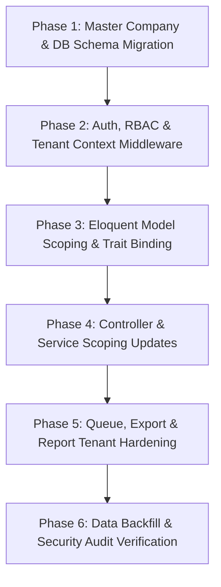

# Multi-Company Architecture Specification — Index

## Executive Summary

This architecture blueprint details the multi-tenant, multi-company transformation of the **Tecla Payroll** system. Currently, the application uses a client-centric model (where `client_id` isolates data across client accounts). This proposal establishes standard multi-company isolation driven by `company_id` across all business entities, ensuring database integrity, security isolation, role-based access control (RBAC), and queue job isolation.

---

## Architectural Objectives

1. **Strict Multi-Company Isolation**: Every business entity must carry a mandatory `company_id` field enforcing multi-tenant boundary checks.
2. **Unified Role Hierarchy**: Support `Super Admin`, `Company Admin`, `Company User`, and `Employee` access levels with company-scoped permission evaluation.
3. **Automated Eloquent Scoping**: Implement a `BelongsToCompany` trait and global `CompanyScope` to prevent accidental cross-company data exposure.
4. **Seamless Context Switching**: Provide Super Admins and Multi-Company Managers with dynamic company-switching capabilities without session corruption.
5. **Zero Data Leakage in Queues & Reports**: Guarantee queue background jobs and export reporting services operate strictly within tenant bounds.

---

## Architecture Documentation Map

| File | Document Title | Description & Scope |
| :--- | :--- | :--- |
| [01-database-company-id-analysis.md](file:///f:/xampp/htdocs/tecla-payroll/docs/architecture/01-database-company-id-analysis.md) | **Database Table & `company_id` Analysis** | Full audit and classification of 50+ database tables, detailing `company_id` requirements, index additions, and foreign key rules. |
| [02-auth-roles-permissions.md](file:///f:/xampp/htdocs/tecla-payroll/docs/architecture/02-auth-roles-permissions.md) | **Authentication, Roles & Permissions** | RBAC model for Super Admin, Company Admin, Company User, and Employee, including module permissions and company user mapping. |
| [03-model-relationships.md](file:///f:/xampp/htdocs/tecla-payroll/docs/architecture/03-model-relationships.md) | **Model Relationships & Scoping** | Eloquent model audit, `BelongsToCompany` trait design, global scoping, and updated relationship definitions. |
| [04-module-impact.md](file:///f:/xampp/htdocs/tecla-payroll/docs/architecture/04-module-impact.md) | **Module Impact Analysis** | Deep-dive impact breakdown across 14 core modules (Employee, Payroll, Leave, Attendance, Statutory PF/ESI/PT/TDS, Invoicing, etc.). |
| [05-multitenant-architecture.md](file:///f:/xampp/htdocs/tecla-payroll/docs/architecture/05-multitenant-architecture.md) | **Multi-Tenant System Architecture** | High-level system architecture, middleware pipeline, API & Queue isolation, and Super Admin company switching mechanism. |
| [06-migration-risk.md](file:///f:/xampp/htdocs/tecla-payroll/docs/architecture/06-migration-risk.md) | **Migration Risk & Mitigation Strategy** | Detailed evaluation of backfill risks, foreign key integrity, cross-company leakage points, and regression test requirements. |

---

## Implementation Phasing Guide

---

*Note: All architecture files listed above are maintained under `docs/architecture/` and timestamped backups under `docs/architecture/2026-08-11_11-27-43/`.*
