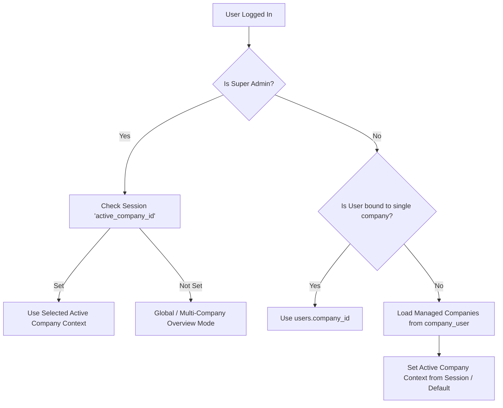

# Authentication, Roles & Permission Architecture

## Overview

The multi-company transformation introduces a 4-tier Role-Based Access Control (RBAC) hierarchy anchored around `company_id`. Users are bound to companies either directly (for single-company access) or via a pivot table (`company_user`) for multi-company access and Super Admin administration.

---

## Role Hierarchy Definition

```text
                               ┌─────────────────────────┐
                               │       SUPER ADMIN       │
                               │  Global System Access   │
                               └────────────┬────────────┘
                                            │
                               ┌────────────▼────────────┐
                               │      COMPANY ADMIN      │
                               │   Full Tenant Admin     │
                               └────────────┬────────────┘
                                            │
                    ┌───────────────────────┴───────────────────────┐
                    │                                               │
       ┌────────────▼────────────┐                     ┌────────────▼────────────┐
       │      COMPANY USER       │                     │      EMPLOYEE / USER    │
       │ HR / Payroll Specialist │                     │   Self-Service Portal   │
       └─────────────────────────┘                     └─────────────────────────┘
```

### Role Specifications

| Role | Scope | Primary Capabilities | `company_id` Handling |
| :--- | :--- | :--- | :--- |
| **Super Admin** (`admin`) | Global (Cross-Company) | Platform administration, onboard new companies, manage billing, global settings, switch active company context on demand. | `company_id = NULL` (or selected `active_company_id` session context). Can access all records across all companies. |
| **Company Admin** (`company_admin` / `manager`) | Single or Multi-Company Admin | Manage company settings, users, payroll cycles, attendance, employee records, statutory filings, and billing for assigned companies. | Bound to specific `company_id`(s) via `users.company_id` or `company_user` pivot table. |
| **Company User** (`company_user` / `staff`) | Single Company (Granular Modules) | Execute day-to-day operations (payroll processing, leave approvals, attendance uploads, document reviews) based on module permissions. | Bound strictly to `users.company_id`. Cannot view or modify data outside assigned company. |
| **Employee / User** (`employee`) | Single Employee Context | Self-service portal: view personal payslips, apply for leave, submit attendance corrections, log tax declarations, view loan status. | Bound to `users.company_id` and `users.employee_id`. Scoped to employee's own record. |

---

## User to `company_id` Association Strategy

### 1. Database Schema Changes for `users` Table

```sql
ALTER TABLE users 
    ADD COLUMN company_id BIGINT UNSIGNED NULL AFTER id,
    ADD CONSTRAINT fk_users_company_id FOREIGN KEY (company_id) REFERENCES companies(id) ON DELETE RESTRICT;

CREATE INDEX idx_users_company_role ON users(company_id, role);
```

### 2. Multi-Company Access Pivot Table (`company_user`)

For accounts (e.g. outsourced HR managers, multi-branch account managers, or external auditors) that manage multiple companies:

```sql
CREATE TABLE company_user (
    id BIGINT UNSIGNED AUTO_INCREMENT PRIMARY KEY,
    user_id BIGINT UNSIGNED NOT NULL,
    company_id BIGINT UNSIGNED NOT NULL,
    role VARCHAR(50) NOT NULL DEFAULT 'company_user',
    created_at TIMESTAMP NULL,
    updated_at TIMESTAMP NULL,
    CONSTRAINT fk_cu_user_id FOREIGN KEY (user_id) REFERENCES users(id) ON DELETE CASCADE,
    CONSTRAINT fk_cu_company_id FOREIGN KEY (company_id) REFERENCES companies(id) ON DELETE CASCADE,
    UNIQUE KEY uq_user_company (user_id, company_id)
);
```

---

## Active Company Context Resolution

When a user logs into the application, their active tenant context (`company_id`) is determined as follows:



### Helper Methods on `User` Model

```php
public function currentCompanyId(): ?int
{
    if ($this->isAdmin()) {
        return session('active_company_id', null);
    }
    
    return $this->company_id ?? session('active_company_id', null);
}

public function getAccessibleCompanyIds(): array
{
    if ($this->isAdmin()) {
        return Company::pluck('id')->toArray();
    }
    
    $ids = [];
    if ($this->company_id) {
        $ids[] = (int) $this->company_id;
    }
    
    $pivotIds = DB::table('company_user')
        ->where('user_id', $this->id)
        ->pluck('company_id')
        ->toArray();
        
    return array_unique(array_merge($ids, $pivotIds));
}

public function belongsToCompany(int $companyId): bool
{
    if ($this->isAdmin()) {
        return true;
    }
    
    return in_array((int) $companyId, $this->getAccessibleCompanyIds());
}
```

---

## Module Permissions & Granular Authorization

Module permissions stored in JSON column `users.module_permissions` will be evaluated strictly in combination with `company_id`:

```php
public function hasCompanyModulePermission(string $moduleKey, ?int $companyId = null): bool
{
    $targetCompanyId = $companyId ?? $this->currentCompanyId();
    
    // 1. Verify tenant access boundary first
    if (!$this->belongsToCompany($targetCompanyId)) {
        return false;
    }
    
    // 2. Super admin and company admins have full module access within their company
    if ($this->isAdmin() || $this->role === 'company_admin') {
        return true;
    }
    
    // 3. Evaluate specific module permission key
    return $this->hasModulePermission($moduleKey);
}
```

---

## Policy & Middleware Integration Pattern

1. **`EnsureCompanyContext` Middleware**: Ensures every web/API request establishes valid `company_id` context.
2. **`CompanyPolicy`**: Validates whether the authenticated user has permission to view, edit, or delete a company-scoped model resource.

```php
public function update(User $user, Employee $employee): bool
{
    return $user->belongsToCompany($employee->company_id) 
        && $user->hasCompanyModulePermission('emp_all', $employee->company_id);
}
```
