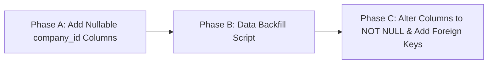

# Migration Risk Analysis & Data Leakage Mitigation

## Overview

Transitioning a production database to strict multi-company isolation introduces data backfill risks, foreign key constraint challenges, performance bottlenecks, and potential cross-company data leakage regression areas. This document categorizes these risks and outlines exact mitigation procedures.

---

## 1. Data Backfill Risks & Strategy

### Risk Factor
Existing database tables contain operational records (`employees`, `attendance_records`, `payroll_runs`, `invoices`, etc.) populated under the legacy `client_id` system without `company_id`. Adding `company_id` as `NOT NULL` without prior backfilling will crash migrations or corrupt schema states.

### Mitigation Strategy: 3-Phase Migration Execution



1. **Phase A Migration**: Add `company_id` as `BIGINT UNSIGNED NULL` across all 43 business tables.
2. **Phase B Backfill**: Execute an idempotent data backfill script:
   - For `clients` table: Populate `company_id` with default master company ID (or create default company record).
   - For tables with direct `client_id` (`employees`, `payroll_runs`, `invoices`, `attendance_records`):
     ```sql
     UPDATE employees e 
     JOIN clients c ON e.client_id = c.id 
     SET e.company_id = c.company_id 
     WHERE e.company_id IS NULL;
     ```
   - For child tables (`employee_documents`, `payroll_run_items`, `invoice_line_items`):
     ```sql
     UPDATE payroll_run_items pri 
     JOIN payroll_runs pr ON pri.payroll_run_id = pr.id 
     SET pri.company_id = pr.company_id 
     WHERE pri.company_id IS NULL;
     ```
3. **Phase C Hardening**: Execute final migration enforcing `NOT NULL` constraints and foreign key relationships.

---

## 2. Foreign Key & Index Integrity Risks

| Area | Risk | Mitigation |
| :--- | :--- | :--- |
| **Foreign Keys** | Orphaned child rows causing foreign key migration failures (`Cannot add foreign key constraint`). | Run orphaned data cleanup scripts prior to executing Phase C FK migrations. |
| **Unique Indexes** | Global unique constraints (e.g., `employees.employee_code`, `invoices.invoice_number`) will reject duplicate codes from different companies. | Drop global unique indexes and replace with composite unique indexes: `UNIQUE(company_id, employee_code)`, `UNIQUE(company_id, invoice_number)`. |
| **Query Performance** | Missing `company_id` in existing indexes causing full table scans during scoped queries. | Add composite indexes starting with `company_id`: `INDEX(company_id, status)`, `INDEX(company_id, date)`. |

---

## 3. Cross-Company Data Leakage Risks & Safeguards

### Risk Area 1: Raw SQL Queries & `DB::table()` Direct Calls
* **Hazard**: Database queries bypassing Eloquent models (e.g. `DB::table('employees')->get()`) skip global `CompanyScope`.
* **Safeguard**: Audit all `DB::` raw query invocations in controllers, services, and reports. Mandate explicit `.where('company_id', $companyId)` on all raw query builders.

### Risk Area 2: Asynchronous Workers & Scheduled Jobs
* **Hazard**: Queue workers processing jobs in the background run without HTTP request session context, defaulting `company_id` to null if not restored.
* **Safeguard**: Mandate `company_id` parameter in all job constructors and invoke `app()->instance('tenant.company_id', $job->companyId)` in job `handle()` method.

### Risk Area 3: Global File Upload Staging Tables
* **Hazard**: `bulk_upload_staging_rows` and `attendance_upload_staging_rows` contain staging data. Concurrent uploads from different companies could leak data if filtered by user ID alone.
* **Safeguard**: Staging tables must store `company_id` on insert and enforce `company_id` matching during batch parsing.

### Risk Area 4: Caching Layer Collision
* **Hazard**: Cache keys (e.g. `Cache::get('active_employees_count')`) cached globally across companies.
* **Safeguard**: Prefix all tenant-specific cache keys with `company_id`: `Cache::get("company_{$companyId}_active_employees_count")`.

---

## 4. Code Regression Checklist

Prior to production deployment of the multi-company update, perform automated and manual verification across these high-risk regression areas:

- [ ] **Auth Login**: Verify Super Admin, Company Admin, Company User, and Employee login routing.
- [ ] **Company Switching**: Verify Super Admin context switching alters visible data instantly without session persistence bugs.
- [ ] **Employee Creation**: Validate duplicate employee codes are permitted across different companies but blocked within the same company.
- [ ] **Attendance Upload**: Upload biometric Excel files for Company A while logged into Company B; ensure rejection.
- [ ] **Payroll Run**: Process payroll for Company A; verify Company B employees are excluded from `payroll_run_items`.
- [ ] **PF ECR File Generation**: Generate PF ECR text file; ensure only Company A employees and UANs appear in output.
- [ ] **Statutory Compliance**: Verify Form 24Q TDS files and PT Challans aggregate numbers strictly within company bounds.
- [ ] **Export & PDF Reports**: Verify Payslip PDFs display correct company branding, logo, address, and statutory codes.
